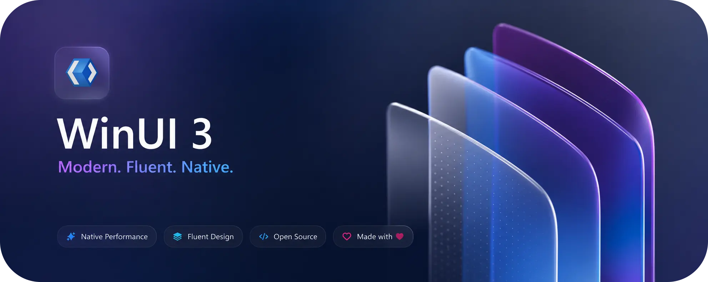

<h1 align="center">WinUI Apps List</h1>

The following is a curated list of applications designed in alignment with the Windows 11 design language, whether built with WinUI 3, UWP, WPF, or related frameworks.

  

  <a href="https://fluentdeck.vercel.app/apps">
    <strong>🚀 <u>Browse the WinUI Apps Directory on Fluentdeck</u></strong>
  </a>

  <b>Please  the repo if you like.</b>

  <a href="https://discord.com/channels/714581497222398064/1127236520366047322">
    <strong><u>WinUI 3 Apps Showcase Discord discussion</u></strong>
  </a>
•  
  <a href="#-newly-added-apps">
    <strong><u>Newly Added Apps</u></strong>
  </a>
•  
  <a href="#-contributing-to-the-winui-apps-list">
    <strong><u>Contributing</u></strong>
  </a>

## 📜 Table Of Contents

<ul>
  <li>📋 <a href="#-disclaimer">Disclaimer</a></li>
  <li>🏷️ <a href="#abbreviations">Abbreviations</a></li>
  <li>🆕 <a href="#-newly-added-apps">Newly Added Apps!</a></li>
  <li>💎 <a href="#-best-implementation-of-winui">Best Implementation of WinUI</a></li>
</ul>
<ul>
  <li>
    

      
📱 Apps List

      <ul>
        <li>🛍️ <a href="#%EF%B8%8F-application-store">Application Store</a></li>
        <li>🤖 <a href="#-artificial-intelligence-ai">Artificial Intelligence (AI)</a></li>
        <li>📕 <a href="#-books--reference">Books & Reference</a></li>
        <li>🌐 <a href="#-browser">Browser</a></li>
        <li>💼 <a href="#-business">Business</a></li>
        <li>
          

            
🧑‍💻 <a href="#%E2%80%8D-developer-tools">Developer Tools</a>

            <ul>
              <li>🐙 <a href="#-github-client">GitHub Client</a></li>
              <li>🛠️ <a href="#-other">Other</a></li>
            </ul>
          

        </li>
        <li>
          

            
⬇️ <a href="#%EF%B8%8F-download-managers">Download Managers</a>

            <ul>
              <li>Full-Featured Download Manager</li>
              <li>Other</li>
              <li>Torrenting</li>
              <li>YouTube</li>
            </ul>
          

        </li>
        <li>🎓 <a href="#-education">Education</a></li>
        <li>📧 <a href="#-email-clients">Email Clients</a></li>
        <li>📱 <a href="#-entertainment">Entertainment</a></li>
        <li>📁 <a href="#-file-manager">File Manager</a></li>
        <li>🎙️ <a href="#%EF%B8%8F-finance">Finance</a></li>
        <li>
          

            
🎮 <a href="#-games">Games</a>

            <ul>
              <li>🎮 Games</li>
              <li>🔧 Game Tools</li>
            </ul>
          

        </li>
        <li>🏡 <a href="#%E2%80%8D%EF%B8%8F-lifestyle">Lifestyle</a></li>
        <li>
          

            
🎬 <a href="#-media">Media</a>

            <ul>
              <li>🎧 Music Players</li>
              <li>Spotify Client</li>
              <li>YT Music Client</li>
              <li>📄 PDF Viewer</li>
              <li>🏜️ Photo Viewer</li>
              <li>🎙️ Podcast</li>
              <li>📺 Streaming Services</li>
              <li>📺 Tracking Services</li>
              <li>▶️ Video Players</li>
              <li>▶️ Other Players</li>
            </ul>
          

        </li>
        <li>🖼️ <a href="#-multimedia--design">Multimedia & Design</a></li>
        <li>📰 <a href="#-news--weather">News & Weather</a></li>
        <li>
          

            
📒 <a href="#-notes--to-do--wish-lists">Notes / To-do / Wish-lists</a>

            <ul>
              <li>⬜ Draw Board</li>
              <li>📝 Notes</li>
              <li>🔔 Reminders</li>
              <li>🔔 To-Do / Task</li>
            </ul>
          

        </li>
        <li>🎨 <a href="#-personalization">Personalization</a></li>
        <li>📈 <a href="#-productivity">Productivity</a></li>
        <li>
          

            
🔐 <a href="#-security--privacy">Security & Privacy</a>

            <ul>
              <li>🔑 2FA</li>
              <li>🔒 Password Managers</li>
              <li>🛡️ Other</li>
            </ul>
          

        </li>
        <li>
          

            
👨‍💻 <a href="#%E2%80%8D-social-media">Social Media</a>

            <ul>
              <li>Discord</li>
              <li>Mastodon</li>
              <li>Reddit</li>
              <li>Steam</li>
              <li>Telegram</li>
              <li>Twitter</li>
              <li>VK</li>
            </ul>
          

        </li>
        <li>
          

            
💻 <a href="#-system">System</a>

            <ul>
              <li>➗ Calculators</li>
              <li>📊 Device Info / Monitors</li>
              <li>🧹 Optimizer / Cleaners</li>
            </ul>
          

        </li>
        <li>🎙️ <a href="#-transcribe">Transcribe</a></li>
        <li>🈵 <a href="#-translators">Translators</a></li>
        <li>🔧 <a href="#-utilities">Utilities</a></li>
        <li>🪟 <a href="#-windows-apps">Windows Apps</a></li>
        <li>🧩 <a href="#-winui-3-catalogs">WinUI 3 Catalogs</a></li>
        <li>🔧 <a href="#-miscellaneous">Miscellaneous</a></li>
      </ul>
    

  </li>
  <li>🤝 <a href="#-contributing-to-the-winui-apps-list">Contributing</a></li>
</ul>

## 📄 Disclaimer

This list is solely a compilation of apps that adopt the WinUI 3 Design guidelines and does not consider the functionality or utility of the listed apps (the listed apps may or may not be useful). There may be other apps that follow WinUI 3 Design guidelines.

- ❗ Some indicators might be wrong as I interpreted whether they're WD/WM/WDM or not by the screenshots. Please report wrong indicators.
- 🔗 The provided links might be from GitHub, GitLab, Telegram, XDA, the Official website of the app and other various sources (I always try to provide GitHub links but some apps are not available on GitHub). Please report any broken links.\*

### Abbreviations

| Indicator / Symbol | Description |
|---|---|
| **`WD`** | Apps that follow WinUI 3 Design Only. |
| **`WDM`** | Apps that have both WinUI 3 design and Mica Material. |
| **`WDA`** | Apps that have both WinUI 3 design and Acrylic Material. |
| `💰` | Paid Apps! |
| `🎨` | Theme! |
| `📆 Planned` | Apps that are in development |
| `❎ Discontinued` | App is discontinued/paused indefinitely |

##  Contributing to the WinUI Apps List

Thank you for being so interested in contributing to the WinUI Apps List! Here's how you can add your app:

1. Fork this repository.
2. Add your app to the appropriate section in the README.md file, following the existing format and alphabetical order.
3. Create a pull request to suggest your changes.
4. I will review your submission and merge it if it meets our criteria.

Please ensure your app fits the WinUI 3 category and provide a brief description and link. Don't forget to add your apps to the [Newly Added Apps](#-newly-added-apps) section.

##  Best Implementation of WinUI

- `WDM` [Ambie](https://github.com/jenius-apps/ambie) `FOSS`
- `WDM` [Eagle-Calculator](https://apps.microsoft.com/detail/Eagle-Calculator/9MX92VG2G7NS)
- `WDM` [Files App](https://github.com/files-community/files)
- `WDM` [Fluent Emoji Gallery](https://github.com/michalleptuch/fluent-emoji-gallery)
- `WDM` [FluentWeather](https://apps.microsoft.com/store/detail/fluentweather/9PFD136M8457)
- `WDM` [Melora](https://github.com/IcySnex/Melora) `FOSS`
- `WDM` [Odyssey](https://github.com/deadw00d/OdysseyWebBrowser)
- `WDM` [Radiograph](https://apps.microsoft.com/store/detail/radiograph/9NH1P86H06CG)
- `WDM` [S Files Pro X - Shrestha File Explorer](https://apps.microsoft.com/detail/s-files-pro-x-shrestha-file-explorer/9NPNFFSV2HQM)
- `WDM` [Wino Mail](https://apps.microsoft.com/store/detail/wino-mail-preview/9NCRCVJC50WL)
- `WDM` [Wintoys](https://apps.microsoft.com/store/detail/wintoys/9P8LTPGCBZXD)
[📑 Table Of Contents](#-table-of-contents)

## 📑 Apps List

### 🆕 Newly Added Apps!

Last 104 apps that were recently added to list!

- `WD` [Angel Umbrella](https://github.com/mntone/AngelUmbrella) `FOSS`
- `WD` [AoE2DE Lobby Browser](https://github.com/tmk907/AoE2DELobbyBrowser) `FOSS`
- `WDM` [Aoe4 Overlay WinUI 3](https://apps.microsoft.com/detail/9np6m86kj0t6)
- `WDM` [Arctic Control](https://github.com/paulober/ArcticControl) FOSS
- `WD` [Arrival](https://github.com/thatweirdbush/arrival) FOSS
- `WD` [Atoll VPN](https://github.com/kaoshipaws/atollvpn)
- `WD` [AudioPlaybackConnector2](https://github.com/N0ahTM/AudioPlaybackConnector2) FOSS
- `WD` [Authik - 2FA Authenticator App](https://apps.microsoft.com/detail/9pn39swmtxr5)
- `WDM` [Auto Center](https://github.com/jihedkdiss/AutoCenter) FOSS
- `WDM` [Automated Menu Ordering System](https://github.com/abdxdev/AMOS) `📆 Planned` `FOSS`
- `WDA` [Awqat-Salaat](https://github.com/Khiro95/Awqat-Salaat) FOSS
- `WDM` [Bal Converter](https://github.com/bozali/bal-converter-deprecated) FOSS
- `WDM` [CineLibrary Essentials](https://github.com/aungkokomm/CineLibraryEssentials) FOSS
- `WDM` [Citrine](https://github.com/CitrineLauncher/Citrine) FOSS
- `WDM` [ClientWarden](https://github.com/Cherrytree56567/ClientWarden) FOSS
- `WD` [ClipCore](https://github.com/Kleaopsy/ClipCore) 📆 Planned FOSS
- `WD` [Cocos](https://github.com/jiripolasek/cocos) `FOSS`
- `WD` [CodexBarWin](https://github.com/nek0der/CodexBarWin) FOSS
- `WD` [Conscripts](https://github.com/sh0ckj0ckey/Conscripts) FOSS
- `WD` [Danmaku Player](https://github.com/Poker-sang/DanmakuPlayer) FOSS
- `WDA` [DeskBox](https://github.com/Tianyu199509/DeskBox) FOSS
- `WD` [Disorder](https://github.com/ewoifuoi/Disorder) `FOSS`
- `WDM` [EasyTidy](https://github.com/EasyTidy/EasyTidy) FOSS
- `WD` [Fellmonger](https://github.com/fbarbat/fellmonger) FOSS
- `WD` [FlowEncode](https://github.com/frankie1024/FlowEncode) FOSS
- `WDM` [Fluent Flet](https://github.com/Bbalduzz/fluentflet) 📆 Planned FOSS
- `WD` [Fluent System Restore](https://github.com/Editird/Rstrui_WinUI3) `FOSS`
- `WDM` [Fluentver](https://github.com/Tech5G5G/Fluentver) FOSS
- `WD` [Folder Icon Painter](https://github.com/FolderPainter/FolderIconPainter) FOSS
- `WDM` [FolderRewind](https://github.com/Leafuke/FolderRewind) FOSS
- `WDM` [ForzaTech Studio](https://github.com/D3FEKT/ForzaTechStudio) FOSS
- `WDA` [GitHub Copilot Taskbar GUI](https://github.com/sirredbeard/ghcopilot-taskbar-gui) FOSS
- `WD` [Grex](https://github.com/visorcraft/Grex) `FOSS`
- `WDM` [GyroShell](https://github.com/Pdawg-bytes/GyroShell) FOSS `📆 Planned`
- `WDM` [Hakonexa](https://github.com/runceel/wsl-containers-desktop) FOSS
- `WD` [HexBox.WinUI](https://github.com/hotkidfamily/HexBox.WinUI) `FOSS`
- `WDM` [Hot Corners](https://github.com/bwya77/Windows-Hot-Corners) FOSS
- `WDA` [Hurl](https://github.com/U-C-S/Hurl) FOSS
- `WD` [InkMD-Editor](https://github.com/tribeti/InkMD-Editor) FOSS
- `WDM` [IRCameraView](https://github.com/Iemand005/IRCameraView) FOSS
- `WD` [ky3-Launcher](https://github.com/ky3-studio/ky3-Launcher) FOSS
- `WD` [LANConnect](https://github.com/WinUI-Dev/LANConnect) `FOSS`
- `WD` [LegendBar](https://github.com/Baldev8910/LegendBar) `FOSS`
- `WD` [LinkTo](https://github.com/abevol/LinkTo) FOSS
- `WD` [Lyra](https://github.com/Turtlepaw/lyra) 📆 Planned FOSS
- `WDM` [Matroska Batch Flow](https://github.com/TimGels/Matroska-Batch-Flow) FOSS
- `WDM` [Melora](https://github.com/IcySnex/Melora) FOSS
- `WDM` [MonitorSync](https://apps.microsoft.com/detail/9pn4pvbqsm1z)
- `WDA` [MoreFlyout](https://github.com/ChenYiLins/MoreFlyout) FOSS
- `WD` [MSIXplainer](https://github.com/aclinick/msixplainer) FOSS
- `WDA` [Music-M](https://github.com/MaKrotos/Music-M) FOSS
- `WD` [My Notebook](https://github.com/aungkokomm/MyNotebook) FOSS
- `WDM` [MyPhone](https://github.com/BestOwl/MyPhone) FOSS
- `WD` [MyTikTokBackup](https://github.com/tmk907/MyTikTokBackup) FOSS
- `WDM` [MyTools](https://github.com/Nostalgia-WZQ/MyTools) FOSS
- `WDM` [NAI Utility Tool](https://github.com/Aeka0/NAI-Utility-Tool) FOSS
- `WDM` [NetProfile Switcher](https://github.com/sixiaolong1117/NetProfile-Switcher) FOSS
- `WDM` [New Eden Roaming Guide](https://github.com/qedsd/TheGuideToTheNewEden) FOSS
- `WD` [Notification Reader](https://github.com/Sudan-Dhungana/NotificationReader-WinUIApp) FOSS
- `WDM` [Nuts - Save & Read](https://apps.microsoft.com/detail/9n36d06frz4g)
- `WD` [NvwUpd](https://github.com/zlicdt/nvwupd) `FOSS`
- `WDM` [OpenClaw Windows Hub](https://github.com/openclaw/openclaw-windows-node) FOSS
- `WDM` [Orayo](https://github.com/barkure/Orayo) FOSS
- `WDM` [optimizerDuck](https://github.com/itsfatduck/optimizerDuck) FOSS
- `WD` [OVR Lighthouse Manager](https://github.com/kurotu/OVR-Lighthouse-Manager) FOSS
- `WD` [Painto](https://github.com/BradleyBao/Painto) `FOSS`
- `WD` [Photo Editor](https://apps.microsoft.com/detail/9p25z49br178)
- `WDM` [Piktosaur](https://github.com/Bloomca/Piktosaur) FOSS
- `WDM` [PortableAppsManager](https://github.com/Jurij15/PortableAppsManager) FOSS
- `WDM` [Porthole](https://github.com/celloza/porthole) FOSS
- `WD` [PreLaunchTaskr](https://github.com/SuGar0218/PreLaunchTaskr) FOSS
- `WD` [Prompt Studio](https://github.com/lightsing/PromptStudio) `FOSS`
- `WD` [Qt-Fluent-Widgets](https://github.com/Fairy-Oracle-Sanctuary/Qt-Fluent-Widgets) FOSS
- `WDM` [RailGo-WinUI](https://github.com/RailGoApps/RailGo-WinUI) FOSS
- `WDM` [Remote Toolbox](https://github.com/sixiaolong1117/WinWoL) FOSS
- `WD` [Scann - PDF Scan](https://apps.microsoft.com/detail/9mxc3k2q8fzn)
- `WD` [ScanStack](https://github.com/Diyari-Kurdi/DeeSharp.ScanStack) FOSS
- `WD` [Screeny](https://github.com/ArnoGevorkyan/Screeny) FOSS
- `WD` [SCSHub](https://github.com/AmirMahdaviAM/SCSHub) FOSS
- `WD` [SmartLinker](https://github.com/theFASTER-UNiTY/SmartLinker) FOSS
- `WD` [Snipik - Screenshot Snipping Tool](https://apps.microsoft.com/detail/9nkcpt766v6d)
- `WDM` [SmoothTube](https://github.com/tatsumioga1/SmoothTube) FOSS
- `WD` [StoryCAD](https://github.com/storybuilder-org/StoryCAD) FOSS
- `WDM` [SUBSTitute](https://github.com/sungaila/SUBSTitute) FOSS
- `WD` [Swell Proxy](https://github.com/yaog6700-bit/Swell-Proxy) FOSS
- `WD` [Task Scheduler Studio](https://github.com/MarkHopper24/Task-Scheduler-Studio) `FOSS`
- `WD` [Tiny Clips](https://github.com/jamesmontemagno/tiny-clips) FOSS
- `WDM` [Transcribe Audio to Text - WizWhisp](https://apps.microsoft.com/detail/9pgq3h6jxl4c)
- `WD` [Trdo](https://github.com/TheJoeFin/Trdo) FOSS
- `WD` [Tuba Toolbox](https://github.com/luolangaga/tubatools) FOSS
- `WDM` [Universal Analog Input](https://github.com/Ritonton/UniversalAnalogInput) FOSS
- `WDA` [Vanilla-RTX-App](https://github.com/Cubeir/Vanilla-RTX-App) FOSS
- `WD` [Verdure Assistant](https://github.com/maker-community/Verdure.Assistant) FOSS
- `WDM` [VirtualPaper](https://github.com/PaperHammer/VirtualPaper) FOSS
- `WD` [Volmix - Volume Mixer](https://apps.microsoft.com/detail/9p5t8mc7nhsm)
- `WDM` [WDCable for Windows](https://github.com/jingcjie/WDCableWUI) FOSS
- `WD` [WhisperShroom](https://github.com/shroomlife/whisper-shroom) FOSS
- `WDM` [WinFocus](https://github.com/Albresky/WinFocus) FOSS
- `WDM` [Win11Debloat](https://github.com/Raphire/Win11Debloat) FOSS
- `WD` [Winhance](https://github.com/memstechtips/Winhance) FOSS
- `WDA` [WinUIEdge](https://github.com/wtcpython/WinUIEdge) FOSS
- `WD` [XrayUI](https://github.com/PhoenixNil/XrayUI-dev) FOSS
- `WDM` [YTDownloader](https://github.com/TXG0Fk3/YTDownloader) FOSS
- `WDM` [Yukari - Comic Manager/Reader](https://github.com/Yukari-App/Yukari) `FOSS`
- `WD` [Zipp - Zip Rar App](https://apps.microsoft.com/detail/9mtnm25fsdrs)
[📑 Table Of Contents](#-table-of-contents)

---

### 🤖 Artificial Intelligence (AI)

- `WDM` [AI Client](https://apps.microsoft.com/detail/9pcs50q9gg7h)
- `WD` [AI Image Generation](https://apps.microsoft.com/detail/9nx86c9rp9bj)
- `WD` [AI Image Tool](https://apps.microsoft.com/detail/9nz73k124x6f)
- `WDM` [AI Notepad](https://apps.microsoft.com/detail/9nxsnfvbkpt2)
- `WDM` [AI Reasoning](https://apps.microsoft.com/detail/9nxj6gs0n493)
- `WD` [AI Rewrite](https://apps.microsoft.com/detail/9pc3xt4xp9wl)
- `WDM` [AI Server](https://apps.microsoft.com/detail/9p42956wbwcl)
- `WDA` [AI Subtitle Translator](https://apps.microsoft.com/detail/9nwxjspzsnl7) `💰`
- `WDM` [AI Suite](https://apps.microsoft.com/detail/9pln2bb2hrjg)
- `WDM` [Ai Super Resolution](https://apps.microsoft.com/detail/9nthdwb338st) `💰`
- `WD` [AI Translate](https://apps.microsoft.com/detail/9nv258h2b565)
- `WD` [AI Video Tool](https://apps.microsoft.com/detail/9nwk0ln9qbz2)
- `WD` [AI Video Upscaler](https://apps.microsoft.com/detail/9pdqmvzz2c1h) `💰`
- `WD` [AI Voice Generation](https://apps.microsoft.com/detail/9p3f6r35cnsx)
- `WDM` [Axela](https://github.com/jpbandroid/Axela) `FOSS`
- `WD` [Be My Eyes](https://apps.microsoft.com/detail/9msw46ltdwgf)
- `WDM` [Bree AI](https://apps.microsoft.com/detail/bree-ai-chat-bot-%26translate/9NXKFGFQNCXS)
- `WDM` [ChatGPT Desktop App](https://github.com/johngagefaulkner/ChatGPTDesktopApp) `📆` `FOSS`
- `WDM` [ChatTailor AI](https://apps.microsoft.com/store/detail/chattailor-ai/9PJRF3ZZ3KHK)
- `WD` [Cocos](https://github.com/jiripolasek/cocos) `FOSS`
- `WD` [CodexBarWin](https://github.com/nek0der/CodexBarWin) `FOSS`
- `WDM` [EasyChat AI](https://apps.microsoft.com/detail/9nxk0pk5zs1b)
- `WDM` [Engage](https://github.com/iamhazel/Engage) `📆 Planned` `FOSS`
- `WDM` [Eppie Mail](https://github.com/Eppie-io/Eppie-App) `FOSS`
- `WDA` [GitHub Copilot Taskbar GUI](https://github.com/sirredbeard/ghcopilot-taskbar-gui) `FOSS`
- `WD` [GPT Labs](https://github.com/mnikonov/gpt-labs)
- `WDM` [Interviewer Copilot](https://apps.microsoft.com/detail/9pjvpmsb6gvh)
- `WDM` [KaiROS AI](https://github.com/avikeid2007/KaiROS-AI) `FOSS`
- `WD` [Local AI Assistant](https://apps.microsoft.com/detail/9n9l7mz02t2n)
- `WD` [Local AI Chatbot](https://apps.microsoft.com/detail/9nxj97jmfxp4)
- `WD` [MaskedAIChat](https://apps.microsoft.com/detail/9pp344qwxrds)
- `WD` [MDC AI](https://apps.microsoft.com/detail/9nw24n9w33c9)
- `WDM` [NAI Utility Tool](https://github.com/Aeka0/NAI-Utility-Tool) `FOSS`
- `WDM` [OpenClaw Windows Hub](https://github.com/openclaw/openclaw-windows-node) `FOSS`
- `WDM` [Paperclip by FireCube](https://apps.microsoft.com/detail/9nwk37s35v5t)
- `WDA` [Perfect Memory](https://apps.microsoft.com/detail/XP9M33WLFS472F)
- `WDM` [Rodel Agent](https://github.com/Richasy/Rodel.Agent) `FOSS`
- `WDM` [Rodel Downloader](https://github.com/Richasy/Rodel.Downloader) `FOSS`
- `WDM` [Transcribe Audio to Text - WizWhisp](https://apps.microsoft.com/detail/9pgq3h6jxl4c)
- `WD` [Verdure Assistant](https://github.com/maker-community/Verdure.Assistant) `FOSS`
- `WD` [Vurbo.ai](https://apps.microsoft.com/detail/9nsccdpxb8vf)
- `WD` [WhisperShroom](https://github.com/shroomlife/whisper-shroom) `FOSS`
- `WDM` [WindowSill](https://getwindowsill.app/)
[📑 Table Of Contents](#-table-of-contents)

---

### 🛍️ Application Store

- `WDA` [FluentStore](https://github.com/yoshiask/FluentStore) `FOSS`
- `WDM` [GetStoreApp](https://apps.microsoft.com/detail/9N6D71Z5X6MM) `FOSS`
- `WDM` [Microsoft Store](https://apps.microsoft.com/home)
- `WDM` [UniGetUI](https://github.com/marticliment/UniGetUI) `FOSS`
---

### 📕 Books & Reference

- `WD` [Audibly — Audiobook Player](https://apps.microsoft.com/detail/9p6r1m1gg9jr)
- `WD` [ePub+](https://apps.microsoft.com/detail/9pfspmjkkqht)
- `WDM` [Rulia - Manga Reader](https://apps.microsoft.com/detail/9mvvlrzwrxx8)
- `WDM` [Yukari - Comic Manager/Reader](https://github.com/Yukari-App/Yukari) `FOSS`
[📑 Table Of Contents](#-table-of-contents)

---

### 💼 Business

- `WD` [SuperPOS](https://apps.microsoft.com/detail/9nqgzwxw33xq)
- `WD` [WINUI3 Book Management System](https://github.com/Sandersshine/WINUI3_BOOKMS) `FOSS`
---

### 🌐 Browser

- `WDM` `WDA` [Arc Browser](https://arc.net/)
- `WDM` `WDA` [Horizon](https://apps.microsoft.com/detail/9pfs0vxcd5sr) `FOSS`

- `WD` [Adv File Explorer](https://apps.microsoft.com/store/detail/adv-file-explorer/9MVSVN9D3G5Z)
- `WD` [App Actions Testing Playground](https://apps.microsoft.com/detail/9plswv2gr8b4)
- `WDM` [Aurora](https://apps.microsoft.com/detail/9mxzldlctfwl)
- `WD` [Azure Key Vault Explorer](https://github.com/sidestep-labs/AzureKeyVaultExplorer)
- `WDM` [ByteStream Torrent](https://apps.microsoft.com/store/detail/bytestream-torrent/9PJT9PBVG7K8)
- `WD` [Codly Snippet Manager](https://apps.microsoft.com/detail/9pgpg8pcf2f9) `💰`
- `WDM` [Colors.Rainbow](https://github.com/sh0ckj0ckey/Colors.Rainbow) `FOSS`
- `WD` [ConTeXt IDE](https://github.com/WelterDevelopment/ConTeXt-IDE-WinUI) `FOSS`
- `WDM` [DbToys](https://github.com/NeilQ/DbToys) `FOSS`
- `WD` [Dev Home GitHub Extension (Preview)](https://apps.microsoft.com/store/detail/dev-home-github-extension-preview/9NZCC27PR6N6)
- `WD` [Developers Toolbox](https://apps.microsoft.com/store/detail/developers-toolbox/9N6J5X2172Q8)
- `WD` [DevToys](https://github.com/DevToys-app/DevToys) `FOSS`
- `WDM` [Files App](https://github.com/files-community/files) `FOSS`
- `WDM` [Firefox-WinUI](https://github.com/Lockframe/Firefox-WinUI) `🎨` `FOSS`
- `WDM` [FluentDL](https://apps.microsoft.com/detail/9mx44km97x7x)
- `WD` [FlyTorrent](https://apps.microsoft.com/detail/9n1zz68cq350)
- `WDA` [Hurl](https://github.com/U-C-S/Hurl) `FOSS`
- `WDM` [Kemono Downloader GUI](https://github.com/ZIDOUZI/Kemono-Downloader-GUI) `FOSS`
- `WDM` [MP3Cube - MP3 Music & Video Downloader 4K](https://apps.microsoft.com/detail/9n615w157bhm)
- `WDM` [My File Explorer](https://apps.microsoft.com/detail/9PNNLGNDKKSC?hl=en-us&gl=IN&ocid=pdpshare)
- `WDM` [MyFTP](https://github.com/luandersonn/MyFTP) `FOSS`
- `WDM` [Odyssey](https://github.com/deadw00d/OdysseyWebBrowser) `📆` `FOSS`
- `WDM` [Parabolic](https://github.com/NickvisionApps/Parabolic) `FOSS`
- `WDM` [qBitTorrent-Fluent theme](https://github.com/witalihirsch/qBitTorrent-fluent-theme) `FOSS`
- `WDM` [Radon Browser](https://github.com/imscythra/radon-browser) `FOSS`
- `WDM` [Rectify11](https://github.com/Rectify11/Installer) `FOSS`
- `WDM` [RetroC IDE](https://github.com/avikeid2007/Retro-C-IDE) `FOSS`
- `WDM` [Riverside Graphite](https://apps.microsoft.com/detail/9PCN40XXVCVB)
- `WDM` [S Files Pro X - Shrestha File Explorer](https://apps.microsoft.com/detail/s-files-pro-x-shrestha-file-explorer/9NPNFFSV2HQM) `💰`
- `WDM` [Segoe Fluent Icons Search](https://apps.microsoft.com/detail/9ndlnl8vq9ct) `💰`
- `WD` [Shrestha Files Free](https://apps.microsoft.com/store/detail/shrestha-files-free/9PLL2XRXQ9LF)
- `WDM` [SmoothTube](https://github.com/tatsumioga1/SmoothTube) `FOSS`
- `WDM` [Sun Valley ttk theme](https://github.com/rdbende/Sun-Valley-ttk-theme) `FOSS`
- `WDM` [SwellSSH](https://github.com/yaog6700-bit/Swell-SSH) `FOSS`
- `WD` [TextDiff UWP](https://apps.microsoft.com/detail/9p8fpd4xs74k) `FOSS`
- `WD` [TubeSync](https://github.com/manusoft/youtube-downloader-desktop) `FOSS`
- `WDM` [TvTime](https://github.com/WinUICommunity/TvTime) `FOSS`
- `WDM` [WinTorrent](https://apps.microsoft.com/detail/9nq9vf309dn6)
- `WDA` [WinUI 3 Serial Port Communication](https://apps.microsoft.com/detail/9n97v1rzgt1p)
- `WDA` [WinUIEdge](https://github.com/wtcpython/WinUIEdge) `FOSS`
- `WDM` [WUC Gallery App](https://apps.microsoft.com/detail/9mswnv3wmqc1)
- `WD` [XAML Lab](https://github.com/WindowsNT/XAML-Lab)
- `WD` [XAML Path Icons](https://apps.microsoft.com/detail/9mtbnqsz9nz9)
- `WDM` [YH File Download Manager](https://apps.microsoft.com/detail/9n1s7g773k1k) `💰`
- `WDM` [youTorrent](https://apps.microsoft.com/detail/9p2qmbvqrcfn)
- `WD` [Zhouyi.WinUI3](https://apps.microsoft.com/detail/9nnxf2qhf21j)
---

### 🧑‍💻 Developer Tools

####  GitHub Client

- `WD` [FluentHub](https://github.com/FluentHub/FluentHub) `FOSS`
- `WD` [JitHub](https://github.com/JitHubApp/JitHubV2) `FOSS`
####  Other

- [📑 Table Of Contents](#-table-of-contents)

- `WD` [AK.Toolkit](https://github.com/AndrewKeepCoding/AK.Toolkit) `FOSS`
- `WD` [App Actions Testing Playground](https://apps.microsoft.com/detail/9plswv2gr8b4)
- `WD` [Azure Key Vault Explorer](https://github.com/sidestep-labs/AzureKeyVaultExplorer)
- `WD` [Codly Snippet Manager](https://apps.microsoft.com/detail/9pgpg8pcf2f9) `💰`
- `WDM` [Colors.Rainbow](https://github.com/sh0ckj0ckey/Colors.Rainbow) `FOSS`
- `WD` [ConTeXt IDE](https://github.com/WelterDevelopment/ConTeXt-IDE-WinUI) `FOSS`
- `WDM` [DbToys](https://github.com/NeilQ/DbToys) `FOSS`
- `WD` [Dev Home GitHub Extension (Preview)](https://apps.microsoft.com/store/detail/dev-home-github-extension-preview/9NZCC27PR6N6)
- `WD` [Developers Toolbox](https://apps.microsoft.com/store/detail/developers-toolbox/9N6J5X2172Q8)
- `WD` [DevToys](https://github.com/DevToys-app/DevToys) `FOSS`
- `WD` [DevWinUI](https://github.com/ghost1372/DevWinUI)
- `WD` [Encrypt Tools](https://apps.microsoft.com/detail/9p8ln5rp6rc6)
- `WD` [Fellmonger](https://github.com/fbarbat/fellmonger) `FOSS`
- `WD` [GWSL](https://apps.microsoft.com/detail/9nl6kd1h33v3)
- `WD` [Grex](https://github.com/visorcraft/Grex) `FOSS`
- `WDM` [Hakonexa](https://github.com/runceel/wsl-containers-desktop) `FOSS`
- `WD` [HexBox.WinUI](https://github.com/hotkidfamily/HexBox.WinUI) `FOSS`
- `WD` [Image Format Conversion Tool](https://apps.microsoft.com/detail/9p9bxtfg4rtn)
- `WD` [IP Port Scanner](https://apps.microsoft.com/detail/9p63kdgkz30d)
- `WDM` [jsree](https://apps.microsoft.com/detail/9plphk05pjf7)
- `WDM` [Loopback Manager](https://github.com/Richasy/LoopbackManager.Desktop) `FOSS`
- `WD` [Network Tools Collection Desktop Edition](https://apps.microsoft.com/detail/9nw6l8plqmm4)
- `WD` [Nuget Pacman](https://apps.microsoft.com/detail/9pb3fzp9nm36) `💰`
- `WDM` [PaletteNet](https://github.com/tmk907/PaletteNet) `FOSS`
- `WD` [PreLaunchTaskr](https://github.com/SuGar0218/PreLaunchTaskr) `FOSS`
- `WDM` [PyQt Fluent Widgets](https://github.com/zhiyiYo/PyQt-Fluent-Widgets) `FOSS`
- `WD` [QTWin11](https://github.com/witalihirsch/QTWin11) `FOSS`
- `WDM` [ReCaptcha.Desktop](https://github.com/IcySnex/ReCaptcha.Desktop) `FOSS`
- `WDM` [Rectify11](https://github.com/Rectify11/Installer) `FOSS`
- `WDM` [RetroC IDE](https://github.com/avikeid2007/Retro-C-IDE) `FOSS`
- `WDM` [Segoe Fluent Icons Search](https://apps.microsoft.com/detail/9ndlnl8vq9ct) `💰`
- `WDM` [Sun Valley ttk theme](https://github.com/rdbende/Sun-Valley-ttk-theme) `FOSS`
- `WDM` [SwellSSH](https://github.com/yaog6700-bit/Swell-SSH) `FOSS`
- `WD` [TextDiff UWP](https://apps.microsoft.com/detail/9p8fpd4xs74k) `FOSS`
- `WDA` [WinUI 3 Serial Port Communication](https://apps.microsoft.com/detail/9n97v1rzgt1p)
- `WDM` [WUC Gallery App](https://apps.microsoft.com/detail/9mswnv3wmqc1)
- `WD` [XAML Lab](https://github.com/WindowsNT/XAML-Lab)
- `WD` [XAML Path Icons](https://apps.microsoft.com/detail/9mtbnqsz9nz9)
---

### ⬇️ Download Managers

- **Full-Featured Download Manager**
- **Other**
- **Torrenting**
- **YouTube**
  - `WDM` `WDA` [Lech YT-DLP](https://apps.microsoft.com/detail/9N28HRK3320G) `FOSS`

- `WDM` [ByteStream Torrent](https://apps.microsoft.com/store/detail/bytestream-torrent/9PJT9PBVG7K8)
- `WD` [Download Manager Kit](https://apps.microsoft.com/detail/9mx6kd8wgwgp)
- `WDM` [FluentDL](https://apps.microsoft.com/detail/9mx44km97x7x)
- `WD` [FlyTorrent](https://apps.microsoft.com/detail/9n1zz68cq350)
- `WDM` [Ghost Downloader](https://github.com/XiaoYouChR/Ghost-Downloader-3) `📆` `FOSS` (Based on [PyQt-Fluent-Widgets](https://github.com/zhiyiYo/PyQt-Fluent-Widgets), not WinUI)
- `WDM` [Kemono Downloader GUI](https://github.com/ZIDOUZI/Kemono-Downloader-GUI) `FOSS`
- `WDM` [MP3Cube - MP3 Music & Video Downloader 4K](https://apps.microsoft.com/detail/9n615w157bhm)
- `WDM` [OnionMedia](https://github.com/onionware-github/OnionMedia) `FOSS`
- `WDM` [Parabolic](https://github.com/NickvisionApps/Parabolic) `FOSS`
- `WDM` [qBitTorrent-Fluent theme](https://github.com/witalihirsch/qBitTorrent-fluent-theme) `FOSS`
- `WDM` [SmoothTube](https://github.com/tatsumioga1/SmoothTube) `FOSS`
- `WD` [TubeSync](https://github.com/manusoft/youtube-downloader-desktop) `FOSS`
- `WDM` [TvTime](https://github.com/WinUICommunity/TvTime) `FOSS`
- `WD` [Ultra Music & Video Downloader PRO](https://apps.microsoft.com/detail/9p9pwlkpr1k8)
- `WDM` [Vidder Video Downloader](https://apps.microsoft.com/detail/9njjx5ns63x2)
- `WDM` [Vido Video and MP3 Music Downloader](https://apps.microsoft.com/detail/9n9tzxcpz5kj)
- `WDM` [WinTorrent](https://apps.microsoft.com/detail/9nq9vf309dn6)
- `WDM` [WinTube](https://github.com/Areoxy/WinTube) `FOSS`
- `WDM` [YH File Download Manager](https://apps.microsoft.com/detail/9n1s7g773k1k) `💰`
- `WDM` [youTorrent](https://apps.microsoft.com/detail/9p2qmbvqrcfn)
- `WD` [YT Video & MP3 Downloader and Converter](https://apps.microsoft.com/detail/9n15nknh976h)
- `WDM` [YTB.Downloader](https://apps.microsoft.com/detail/9nlcb909p1cf)
- `WDM` [YTMP3 Video Downloader and YT MP3 Converter](https://apps.microsoft.com/detail/9p59cckx7c5x)
---

### 🎓 Education

- `WDM` [English Dictionary - Offline](https://apps.microsoft.com/detail/9nsmlkmc3wb6)
- `WDM` [Selectivitapp](https://apps.microsoft.com/detail/9mx6hrgbg9tg)
- `WDM` [Skolar](https://apps.microsoft.com/detail/9wzdncrdmq0t)
- `WD` [Zhouyi.WinUI3](https://apps.microsoft.com/detail/9nnxf2qhf21j)
---

### 📧 Email Clients

- `WDM` [Email Inboxes](https://apps.microsoft.com/detail/9mx57pfkf3gc)
- `WDM` [Eppie Mail](https://github.com/Eppie-io/Eppie-App) `FOSS`
- `WDM` [Outlook for Windows](https://apps.microsoft.com/detail/9NRX63209R7B?ocid=pdpshare&hl=en-us&gl=US)
- `WDM` [Wino Mail](https://github.com/bkaankose/Wino-Mail) `FOSS`
---

### 📱 Entertainment

- `WDM` [AirPlayReceiver: Screen Mirroring & Streaming](https://apps.microsoft.com/detail/9n4xf19xfjd8)
- `WDM` [DLNA Receiver & Player](https://apps.microsoft.com/detail/9npwbh9htstw)
- `WD` [MouseLink](https://apps.microsoft.com/detail/xpffzbsvfp53j6)
---

### 📁 File Manager

- `WDM` `WDA` [RX-Explorer (WAS)](https://apps.microsoft.com/detail/9pdn2q3dcqs3) `💰`

- `WD` [Adv File Explorer](https://apps.microsoft.com/store/detail/adv-file-explorer/9MVSVN9D3G5Z)
- `WDM` [Any Image Converter.](https://apps.microsoft.com/detail/9nwqc9kdxktb)
- `WDM` [ArtWorks](https://apps.microsoft.com/detail/9n5l51xtrj19)
- `WD` [AT-Image-Converter](https://github.com/airtaxi/AT-Image-Converter) `FOSS`
- `WD` [FaceFusion](https://apps.microsoft.com/detail/9n51zv1t45wr)
- `WDM` [Files App](https://github.com/files-community/files) `FOSS`
- `WDM` [HEIC Converter - ModernHEIC Converter](https://apps.microsoft.com/detail/9n3r0h3x6gm9)
- `WDM` [HEIC to JPEG](https://apps.microsoft.com/store/detail/9ntvcmpjm5v3)
- `WDM` [HEIC.JPG Converter](https://apps.microsoft.com/detail/9nw5p352bqm8) `💰`
- `WD` [ImageRate & Slideshow](https://apps.microsoft.com/detail/9nz1b660k8mc)
- `WDM` [ImageScaler - Batch Image Resizer](https://apps.microsoft.com/detail/9pg8fq5pspdc) `💰`
- `WDM` [ImgConverter - Convert Your Images](https://apps.microsoft.com/detail/9nn18b4dvfdf)
- `WD` [LL Video Audio Converter](https://apps.microsoft.com/detail/9n9sb1k40kgc)
- `WDM` [ModernICO Converter](https://apps.microsoft.com/detail/9nzl0c0z1mmk)
- `WDM` [My File Explorer](https://apps.microsoft.com/detail/9PNNLGNDKKSC?hl=en-us&gl=IN&ocid=pdpshare)
- `WDM` [MyFTP](https://github.com/luandersonn/MyFTP) `FOSS`
- `WDM` [PhotoToys Next](https://apps.microsoft.com/detail/9n9v3rmhsn0r)
- `WDM` [Pixeval](https://apps.microsoft.com/detail/9p1rzl9z8454)
- `WDM` [S Files Pro X - Shrestha File Explorer](https://apps.microsoft.com/detail/s-files-pro-x-shrestha-file-explorer/9NPNFFSV2HQM) `💰`
- `WD` [Shrestha Files Free](https://apps.microsoft.com/store/detail/shrestha-files-free/9PLL2XRXQ9LF)
- `WD` [Turbo Play](https://apps.microsoft.com/detail/9phlccswskn2)
- `WDM` [Visum Photo Viewer](https://apps.microsoft.com/detail/9n1x3z50blm8)
- `WDM` [Webp Converter | Convert to PNG JPEG](https://apps.microsoft.com/detail/9nnzjtc21gdj)
- `WDM` [WebToImage - Webpage to Image](https://apps.microsoft.com/detail/9nhjm003mmsq) `💰`
[📑 Table Of Contents](#-table-of-contents)

---

### 🎙️ Finance

- `WDM` [BitWallpaper](https://github.com/torum/BitWallpaper) `FOSS`
---

### 🎮 Games

- `WM` [Fluent 2048](https://github.com/Zingzy/fluent-2048) `FOSS`

- `WDM` [Emerald](https://github.com/RiversideValley/Emerald) `FOSS`
- `WDM` [Fluent-Tic-Tac-Toe](https://github.com/dfchang149/Fluent-Tic-Tac-Toe) `FOSS`
- `WDA` [Gues.io](https://www.microsoft.com/en-in/p/guesio/9mt0dpsh2lcw)
- `WDM` [OurSweeper](https://www.xbox.com/en-in/games/store/oursweeper/9pb8sdwv419v?rtc=1)
- `WDM` [Sudoku](https://www.microsoft.com/en-in/p/sudoku/9NBLGGH08DC5)
#### Game Tools

- `WM` [Mixplay for Mixer](https://apps.microsoft.com/store/detail/mixplay-for-mixer/9PN94D9BDFZM)

- `WD` [AoE2DE Lobby Browser](https://github.com/tmk907/AoE2DELobbyBrowser) `FOSS`
- `WDM` [Aoe4 Overlay WinUI 3](https://apps.microsoft.com/detail/9np6m86kj0t6)
- `WDM` [BallanceLauncher](https://github.com/Ghomist/BallanceLauncher) `FOSS`
- `WDM` [Bloxstrap](https://github.com/pizzaboxer/bloxstrap) `FOSS`
- `WDM` [Citrine](https://github.com/CitrineLauncher/Citrine) `FOSS`
- `WDA` [Collapse](https://github.com/CollapseLauncher/Collapse) `FOSS`
- `WDM` [DialogueForest](https://github.com/Difegue/DialogueForest) `FOSS`
- `WDM` [Dotahold](https://github.com/sh0ckj0ckey/Dotahold) `FOSS`
- `WDM` [Game Calender](https://apps.microsoft.com/detail/9wzdncrd1p4n)
- `WD` [GenshinSwitch](https://github.com/GenshinMatrix/genshin-switch) `FOSS`
- `WDM` [Handheld Companion](https://github.com/Valkirie/HandheldCompanion) `FOSS`
- `WD` [ky3-Launcher](https://github.com/ky3-studio/ky3-Launcher) `FOSS`
- `WDM` [MCSkinn](https://apps.microsoft.com/detail/9N8SJT329HH1?hl=zh-cn&gl=US&ocid=pdpshare)
- `WDA` [Natsurainko.FluentLauncher](https://github.com/Xcube-Studio/Natsurainko.FluentLauncher) `FOSS`
- `WDM` [New Eden Roaming Guide](https://github.com/qedsd/TheGuideToTheNewEden) `FOSS`
- `WD` [OmniConsole](https://github.com/8bit2qubit/OmniConsole) `FOSS`
- `WD` [OVR Lighthouse Manager](https://github.com/kurotu/OVR-Lighthouse-Manager) `FOSS`
- `WDM` [Polymerium](https://github.com/d3ara1n/Polymerium) `FOSS`
- `WDM` [PortableAppsManager](https://github.com/Jurij15/PortableAppsManager) `FOSS`
- `WD` [SCSHub](https://github.com/AmirMahdaviAM/SCSHub) `FOSS`
- `WDA` [Vanilla-RTX-App](https://github.com/Cubeir/Vanilla-RTX-App) `FOSS`
- `WDM` [WinFocus](https://github.com/Albresky/WinFocus) `FOSS`
- `WDM` [XianYuLauncher](https://apps.microsoft.com/detail/9pcnpgl7j6ks) `FOSS`
- `WD` [YT2MP3](https://github.com/0zean/YT2MP3) `FOSS`
[📑 Table Of Contents](#-table-of-contents)

---

### 🙎‍♂️ Lifestyle

- `WDM` [Ambie](https://github.com/jenius-apps/ambie) `FOSS`
- `WD` [iCollect Everything](https://apps.microsoft.com/detail/9pfz333ctd90)
---

### 🎬 Media

#### 🎧 Music Players

- **Music Tools**

- `WDM` [Audio Converter - ModernMedia Converter](https://apps.microsoft.com/detail/9nn2zc496lw5)
- `WDA` [BetterLyrics](https://apps.microsoft.com/detail/9p1wcd1p597r)
- `WDA` [Disenchant Music Player](https://github.com/DenryDu/Disenchant-Music-Player) `📆 Planned` `FOSS`
- `WD` [Folderity](https://github.com/Shailosingh/Folderity) `📆 Planned` `FOSS`
- `WDM` [haikusMediaPlayer](https://github.com/haiku-balls/haikusMediaPlayer) `FOSS`
- `WDM` [HotLyric](https://www.microsoft.com/store/productId/9MXFFHVQVBV9)
- `WDM` [LyricEase](https://install.appcenter.ms/users/brandonw3612/apps/lyricease/distribution_groups/public)
- `WDM` [Melora](https://github.com/IcySnex/Melora) `FOSS`
- `WDM` [Melosik](https://apps.microsoft.com/store/detail/melosik-music-player-for-windows/9NH759PMH26M)
- `WD` [MPDCtrl](https://github.com/torum/MPDCtrl)
- `WDA` [Music-M](https://github.com/MaKrotos/Music-M) `FOSS`
- `WDM` [Musicloud - Music Downloader](https://apps.microsoft.com/store/detail/musicloud-music-downloader/9P6V0D62D4BQ)
- `WDM` [Musium](https://github.com/paste1ess/Musium) `FOSS`
- `WDM` [Nagi](https://apps.microsoft.com/detail/9p1v1ppml3qt) .
- `WDM` [Pinnacle Media Player](https://apps.microsoft.com/store/detail/pinnacle-media-player/9P534C2W7JK3)
- `WDM` [PlanetMusic](https://apps.microsoft.com/detail/9nt5122pwqb8)
- `WD` [PlayerWinRT](https://github.com/YexuanXiao/PlayerWinRT) `FOSS`
- `WD` [PodcastChapterEditor](https://github.com/snivets/PodcastChapterEditor) `FOSS`
- `WDM` [Rise Media Player](https://github.com/Rise-Software/Rise-Media-Player) `FOSS`
- `WDA` [Salt Player for Windows](https://apps.microsoft.com/detail/9p42fq0wpqxk)
- `WDM` [Screenbox](https://github.com/huynhsontung/Screenbox/) `FOSS`
- `WDM` [Strix Music](https://github.com/Arlodotexe/strix-music) `FOSS`
- `WDM` [Stylophone](https://github.com/Difegue/Stylophone) `FOSS`
- `WDA` [TagEditor](https://github.com/danvlsv/TagEditor) `FOSS`
- `WDM` [Tagger](https://github.com/NickvisionApps/Tagger) `FOSS`
- `WD` [Trdo](https://github.com/TheJoeFin/Trdo) `FOSS`
- `WDM` [Untamed Music Player](https://github.com/LanZhan-Harmony/WindowsMusicPlayer-TheUntamedMusicPlayer) `FOSS`
- `WDM` [Vidder Video Downloader](https://apps.microsoft.com/detail/9njjx5ns63x2)
- `WDM` [Video Media Player - All Formats](https://apps.microsoft.com/detail/9n5j0j3fcg8t)
- `WDM` [VideoGenius - Any Video Converter](https://apps.microsoft.com/detail/9mxrwwzxn8dk) `💰`
- `WDM` [Vido Video and MP3 Music Downloader](https://apps.microsoft.com/detail/9n9tzxcpz5kj)
- `WD` [YT Video & MP3 Downloader and Converter](https://apps.microsoft.com/detail/9n15nknh976h)
- `WDM` [YTB.Downloader](https://apps.microsoft.com/detail/9nlcb909p1cf)
- `WDM` [YTMP3 Video Downloader and YT MP3 Converter](https://apps.microsoft.com/detail/9p59cckx7c5x)
- `WDM` [Yugen.DJ](https://github.com/Yugen-Apps/Yugen.DJ) `FOSS`
####  Spotify Client

- `WDM` [Any Image Converter.](https://apps.microsoft.com/detail/9nwqc9kdxktb)
- `WDM` [ArtWork](https://github.com/ghost1372/ArtWork) `FOSS`
- `WD` [AT-Image-Converter](https://github.com/airtaxi/AT-Image-Converter) `FOSS`
- `WD` [FaceFusion](https://apps.microsoft.com/detail/9n51zv1t45wr)
- `WDM` [HEIC Converter - ModernHEIC Converter](https://apps.microsoft.com/detail/9n3r0h3x6gm9)
- `WDM` [HEIC.JPG Converter](https://apps.microsoft.com/detail/9nw5p352bqm8) `💰`
- `WDM` [Piktosaur](https://github.com/Bloomca/Piktosaur) `FOSS`
- `WDM` [Sakura Photo Viewer](https://apps.microsoft.com/store/detail/sakura-photo-viewer/9PG9N9FTR590)
- `WDM` [Visum Photo Viewer](https://apps.microsoft.com/detail/9n1x3z50blm8)
- `WDM` [WaveeMusic](https://github.com/christosk92/WaveeMusic) `📆` `FOSS`
####  YT Music Client

- `WD` [YT Music Lite](https://apps.microsoft.com/detail/9nhpxcxs27f9)
#### 📄 PDF Viewer

- **PDF Tools**

- `WDM` [Easy PDF](https://apps.microsoft.com/detail/9p02klsbznmn)
- `WDM` [Fluetro PDF](https://apps.microsoft.com/detail/9nsr7b2lt6ln)
- `WDM` [PageToPDF - Webpage to PDF](https://apps.microsoft.com/detail/9nc15tmpz901) `💰`
- `WDM` [PDF Creator from Images](https://apps.microsoft.com/detail/9nxrg1l5rmp6)
- `WD` [PDF Jack](https://apps.microsoft.com/store/detail/pdf-jack/9NBLGGH1P3P6)
- `WDM` [PDF Merger | Reorder Pages | Secure Files](https://apps.microsoft.com/detail/9pdlmtdwkkrn)
- `WDM` [PDF Splitter / Merger](https://apps.microsoft.com/detail/9n2kgnh5bz8f)
- `WDM` [PDF.Office Converter](https://apps.microsoft.com/detail/9nw5c7830tnw)
#### 🏜️ Photo Viewer

- **Image Tools**

- `WDM` [Any Image Converter.](https://apps.microsoft.com/detail/9nwqc9kdxktb)
- `WDM` [ArtWork](https://github.com/ghost1372/ArtWork) `FOSS`
- `WDM` [ArtWorks](https://apps.microsoft.com/detail/9n5l51xtrj19)
- `WD` [AT-Image-Converter](https://github.com/airtaxi/AT-Image-Converter) `FOSS`
- `WD` [FaceFusion](https://apps.microsoft.com/detail/9n51zv1t45wr)
- `WDM` [HEIC Converter - ModernHEIC Converter](https://apps.microsoft.com/detail/9n3r0h3x6gm9)
- `WDM` [HEIC to JPEG](https://apps.microsoft.com/store/detail/9ntvcmpjm5v3)
- `WDM` [HEIC.JPG Converter](https://apps.microsoft.com/detail/9nw5p352bqm8) `💰`
- `WDM` [Image Viewer](https://github.com/dragonofmercy/image-viewer) `FOSS`
- `WD` [ImageRate & Slideshow](https://apps.microsoft.com/detail/9nz1b660k8mc)
- `WDM` [ImageScaler - Batch Image Resizer](https://apps.microsoft.com/detail/9pg8fq5pspdc) `💰`
- `WDM` [ImgConverter - Convert Your Images](https://apps.microsoft.com/detail/9nn18b4dvfdf)
- `WD` [LL Video Audio Converter](https://apps.microsoft.com/detail/9n9sb1k40kgc)
- `WDM` [ModernICO Converter](https://apps.microsoft.com/detail/9nzl0c0z1mmk)
- `WDM` [PhotoToys Next](https://apps.microsoft.com/detail/9n9v3rmhsn0r)
- `WDM` [Piktosaur](https://github.com/Bloomca/Piktosaur) `FOSS`
- `WDM` [Pixeval](https://apps.microsoft.com/detail/9p1rzl9z8454)
- `WDM` [Sakura Photo Viewer](https://apps.microsoft.com/store/detail/sakura-photo-viewer/9PG9N9FTR590)
- `WD` [Turbo Play](https://apps.microsoft.com/detail/9phlccswskn2)
- `WDM` [Visum Photo Viewer](https://apps.microsoft.com/detail/9n1x3z50blm8)
- `WDM` [Webp Converter | Convert to PNG JPEG](https://apps.microsoft.com/detail/9nnzjtc21gdj)
- `WDM` [WebToImage - Webpage to Image](https://apps.microsoft.com/detail/9nhjm003mmsq) `💰`
#### 🎙️ Podcast

- `WDM` [FluentCast](https://apps.microsoft.com/detail/9pm46jrsdqqr)
- `WDM` [Grover Podcast](https://matheus-inacio.github.io/grover-podcast/)
- `WDM` [Podcasted](https://apps.microsoft.com/detail/9nxwgr2b1p26)
#### 📺 Streaming Services

- `WDM` [Apple Music](https://apps.microsoft.com/detail/9pfhdd62mxs1)
- `WDM` [Apple TV](https://apps.microsoft.com/detail/9nm4t8b9jqz1)
- `WDA` [FluentFin](https://github.com/insomniachi/FluentFin)
- `WDM` [HyPlayer](https://github.com/HyPlayer/HyPlayer) `FOSS`
- `WDM` [MovTv](https://apps.microsoft.com/detail/9ns64tczr3w9)
#### 📺 Tracking Services

- `WDM` [AniMoe](https://github.com/CosmicPredator/AniMoe) `FOSS`
- `WDM` [Bili.Copilot](https://github.com/Richasy/Bili.Copilot) `FOSS`
- `WDM` [BiliLite](https://github.com/ywmoyue/biliuwp-lite) `FOSS`
- `WD` [iCollect Everything](https://apps.microsoft.com/detail/9pfz333ctd90)
- `WDM` [Movier](https://apps.microsoft.com/detail/9ncf5gmw8q1q)
- `WDM` [Totoro](https://github.com/insomniachi/Totoro) `FOSS`
#### ▶️ Video Players

- **Video Tools**

- `WDM` [Any-Video Converter](https://apps.microsoft.com/detail/9p3wgnxq800d)
- `WDM` [Awesome Media Player WinUI3](https://github.com/BluDay/awesome-media-player-winui3) `📆` `FOSS`
- `WD` [Danmaku Player](https://github.com/Poker-sang/DanmakuPlayer) `FOSS`
- `WD` [Easy Floating Player](https://apps.microsoft.com/detail/9p7sgjjdshj9)
- `WDM` [Netease Filmly](https://bmh.163.com/) `📆`
- `WDA` [Player for Media](https://apps.microsoft.com/detail/9pjrlgb4n2ss)
- `WDM` [Rise Media Player](https://github.com/Rise-Software/Rise-Media-Player) `FOSS`
- `WDM` [Rodel Player](https://apps.microsoft.com/detail/9nb0h051m4v4) `📆`
- `WDM` [Screenbox](https://github.com/huynhsontung/Screenbox/) `FOSS`
#### ▶️ Other Players

- **🔧 Tools**

- `WD` [Aggregate Live Broadcast](https://apps.microsoft.com/detail/9n1twg2g84vd)
- `WDM` [Ambie](https://github.com/jenius-apps/ambie) `FOSS`
- `WDM` [Blu-ray Player](https://apps.microsoft.com/detail/9ntn82vjlpfq)
- `WDM` [CD Ripper - Rip CD to Mp3](https://apps.microsoft.com/detail/9pgs5rbvwjzb)
- `WDM` [DVD Player - Play DVD](https://apps.microsoft.com/detail/9pc9t9bsqklt)
- `WDM` [DVD Ripper](https://apps.microsoft.com/detail/9np0ktx797vl)
- `WD` [Hills Lite](https://apps.microsoft.com/detail/9nxnzfrllwzx)
- `WD` [iPlay X](https://apps.microsoft.com/detail/9nbz2bxd4wfz)
- `WDM` [IPTV Fluent](https://apps.microsoft.com/detail/9pkmdlwbc8zj)
- `WD` [Reborn Live](https://apps.microsoft.com/detail/9nng4s1wn5fp)
[📑 Table Of Contents](#-table-of-contents)

---

### 💠 Multimedia & Design

- `WDM` [Camo](https://reincubate.com/camo/)
- `WDM` [Character Map UWP](https://github.com/character-map-uwp/Character-Map-UWP) `FOSS`
- `WDM` [Fluent Emoji Gallery](https://github.com/michalleptuch/fluent-emoji-gallery) `FOSS`
- `WDM` [Fluent Noise Generator](https://github.com/bluday/fluent-noise-generator) `FOSS`
- `WD` [ImagineIt](https://apps.microsoft.com/detail/9nthbmqz5bwf)
- `WD` [PageFabric](https://apps.microsoft.com/detail/9p170799pf3q)
- `WD` [Painto](https://github.com/BradleyBao/Painto) `FOSS`
- `WDM` [Sketchable Plus](https://apps.microsoft.com/store/detail/sketchable-plus/9MZZLHTZ5N02)
- `WDM` [Summer](https://github.com/sh0ckj0ckey/Summer) `FOSS`
- `WD` [System Color Picker](https://apps.microsoft.com/detail/9pdncssk83f1)
- `WDM` [The Color Palette](https://apps.microsoft.com/store/detail/the-color-palette/9PBK4B7HBJXG)
- `WD` [Unpaint](https://github.com/axodox/unpaint) `FOSS`
[📑 Table Of Contents](#-table-of-contents)

---

### 📰 News & Weather

- `WD` [FeedDesk](https://github.com/torum/FeedDesk) `FOSS`
- `WDM` [Fluent Feeds](https://github.com/hannesschulze/fluent-feeds) `FOSS`
- `WDM` [Fluent HN - Hacker News client](https://apps.microsoft.com/detail/9n8pdzhcpqhx) `💰`
- `WDM` [FluentWeather](https://github.com/Gabboxl/FluentWeather) `FOSS`
- `WDM` [LightWeather](https://apps.microsoft.com/detail/9nblggh516s4)
- `WDM` [Lively Weather](https://apps.microsoft.com/detail/9pp0mfqfvsc5)
- `WDM` [Skyline Weather](https://github.com/zxbmmmmmmmmm/SkylineWeather) `FOSS`
- `WD` [Āēr Weather](https://github.com/mavlac/aer-weather) `FOSS`
---

### 📒 Notes / To-do / Wish-lists

#### ⬜ Draw Board

- `WDM` [FlowBoard](https://github.com/FireCubeStudios/FlowBoard/tree/master/FlowBoard) `FOSS`
- `WD` [Ink Canvas Artistry](https://github.com/InkCanvas/Ink-Canvas-Artistry) `FOSS`
#### 📝 Notes

- `WDM` `WDA` [MyNotes](https://github.com/ErenCanUtku/MyNotes) `FOSS`

- `WD` [DiaryFlow](https://apps.microsoft.com/detail/9p76ns4k0hgf)
- `WDM` [DucklingMemo - Sticky notes app](https://apps.microsoft.com/detail/9n5sf581v968)
- `WDM` [Fairmark](https://apps.microsoft.com/detail/9pdm2qk92715)
- `WDM` [Fastedit](https://github.com/FrozenAssassine/Fastedit) `FOSS`
- `WDM` [Ferrpad](https://github.com/shef3r/ferrpad) `FOSS`
- `WDM` [FluentEdit](https://apps.microsoft.com/store/detail/fluentedit/9NWL9M9JPQ36)
- `WDM` [HikariEditor](https://github.com/Himeyama/HikariEditor) `FOSS`
- `WDM` [HiNote](https://apps.microsoft.com/store/detail/9N94LT5S8FD9)
- `WD` [InkMD-Editor](https://github.com/tribeti/InkMD-Editor) `FOSS`
- `WDM` [Ivirius Text Editor](https://github.com/IviriusMain/Ivirius-Text-Editor) `FOSS`
- `WDM` [Mica Editor](https://www.microsoft.com/store/apps/9PGZBDP9PSPF)
- `WD` [Miyanyedi Quick Note](https://apps.microsoft.com/detail/9pgb6sqsk601)
- `WDM` [Quick Pad](https://apps.microsoft.com/store/detail/quick-pad-fluent-notepad-app/9PDLWQHTLSV3?hl) `💰`
- `WD` [READU.md](https://github.com/breezy89757/READU.md) `FOSS`
- `WDM` [RectifyPad](https://github.com/Lixkote/WritePad) `FOSS`
- `WD` [SkyNotepad](https://github.com/lnxwizard/SkyNotepad) `FOSS`
- `WDM` [Sticky Notes Studio](https://apps.microsoft.com/detail/9n22flw0gqqw)
- `WDM` [Storylines](https://github.com/morning4coffe-dev/storylines) `FOSS`
- `WDM` [TowPad](https://github.com/itsWindows11/TowPad) `FOSS`
- `WDM` [Typedown](https://github.com/byxiaozhi/Typedown) `FOSS`
#### 🔔 Reminders

- `WDM` `WDA` [MyNotes](https://github.com/ErenCanUtku/MyNotes) `FOSS`

- `WDM` [Mica For Everyone](https://github.com/MicaForEveryone/MicaForEveryone) `FOSS`
- `WDM` [MyDay - Hourly Day Planner](https://apps.microsoft.com/store/detail/myday-hourly-day-planner/9P8QTKPD2WK3) `💰`
- `WDM` [MyerSplash](https://apps.microsoft.com/store/detail/myersplash-photos/9NBLGGH4VCSN?hl=en-in&gl=in&rtc=1)
- `WDM` [Quick Reminder Alerts](https://apps.microsoft.com/detail/9mw5vrl0bqt9) `💰`
- `WD` [RainbowFrame](https://apps.microsoft.com/detail/9p0pflqk1b0w)
- `WD` [Rebound](https://github.com/IviriusCommunity/Rebound)
- `WDM` [Startify](https://github.com/Lixkote/Startify)
- `WDM` [T-Drive](https://apps.microsoft.com/detail/9mvd1pkdtxsn)
- `WDM` [Tabbed](https://apps.microsoft.com/detail/9pntw3wl9srq)
- `WDM` [TheMenu](https://apps.microsoft.com/detail/9p1rpmsh1tpb) `💰`
- `WDM` [Timeline Wallpaper](https://apps.microsoft.com/detail/9n7vhq989bb7)
- `WDM` [TranslucentSM](https://github.com/rounk-ctrl/TranslucentSM) `FOSS`
- `WD` [VideoScreensaver](https://apps.microsoft.com/detail/9nkx7w0j4cst)
- `WDA` [Widget Pro](https://apps.microsoft.com/detail/9nv0n2fwq00d)
- `WDM` [Windows Custom Tile](https://github.com/fischldesu/WindowsCustomTile) `FOSS`
- `WDM` [WindowSill](https://getwindowsill.app/)
- `WD` [WinPaletter](https://github.com/Abdelrhman-AK/WinPaletter) `FOSS`
- `WD` [WinUI3 File Search Engine](https://github.com/israel-dryer/WinUI3-File-Search-Engine) `FOSS`
- `WD` [Words come true](https://apps.microsoft.com/detail/9pdz7s5z1zh2)
- `WD` [YASB GUI](https://github.com/amnweb/yasb-gui) `FOSS`
#### 🔔 To-Do / Task

- `WDM` [Daily ToDo Lists](https://apps.microsoft.com/detail/9pmw2fdm4dld) `💰`
- `WDM` [DayDayUp](https://github.com/Fangjin98/daydayup) `📆` `FOSS`
- `WDM` [FluentTasks - Task Manager & To-Do List](https://apps.microsoft.com/detail/9pjxbn8816ff)
- `WD` [Microsoft To Do](https://apps.microsoft.com/detail/9nblggh5r558)
- `WDM` [Taskie](https://apps.microsoft.com/detail/9n201wbcfj91)
- `WDM` [TaskList](https://github.com/GuildOfCalamity/TaskList) `📆` `FOSS`
- `WDA` [ToDoManager](https://github.com/navi705/ToDoManager-WinUI3) `📆` `FOSS`
- `WDM` [WinUI3-TaskList](https://github.com/tamil1809/WinUI3-TaskList) `FOSS`
[📑 Table Of Contents](#-table-of-contents)

---

### 🎨 Personalization

- `WDM` `WDA` [Sucrose Wallpaper Engine](https://apps.microsoft.com/detail/xp8jgpbhtjglcq)

- `WDM` [AccentColorizer](https://github.com/krlvm/AccentColorizer) `FOSS`
- `WDM` [Acrylic](https://apps.microsoft.com/detail/acrylic%E2%84%A2%EF%B8%8F/9PHF4S5SJJG3) `💰`
- `WDM` [AI Wallpapers](https://apps.microsoft.com/store/detail/ai-wallpapers/9NSQGRZKH163)
- `WDM` [Auto Dark Mode](https://apps.microsoft.com/store/detail/auto-dark-mode/XP8JK4HZBVF435) `FOSS`
- `WD` [Backgrounds Wallpapers Pack](https://apps.microsoft.com/detail/9nblggh2sfgp)
- `WDM` [backiee - Wallpaper Studio 10](https://apps.microsoft.com/detail/9wzdncrfhzcd)
- `WDM` [BeWidgets](https://apps.microsoft.com/detail/9nq07fg50h2q)
- `WDM` [ChangeFolderIcon](https://github.com/YILING0013/ChangeFolderIcon) `FOSS`
- `WDM` [Croak](https://github.com/MehranAkbarii/Croak) `FOSS`
- `WDM` [Custom Folder Icon Changer](https://apps.microsoft.com/store/detail/foldericonizer-change-folder-icons/9PLQDJ5XCNL3) `💰`
- `WDA` [DeskBox](https://github.com/Tianyu199509/DeskBox) `FOSS`
- `WDM` [Desktop Live Wallpapers](https://apps.microsoft.com/store/detail/desktop-live-wallpapers/9NZ370XBFQMG)
- `WDM` [Dynamic theme](https://apps.microsoft.com/store/detail/dynamic-theme/9NBLGGH1ZBKW)
- `WDM` [EverythingToolbar](https://github.com/srwi/EverythingToolbar) `FOSS`
- `WDA` [Fold11](https://apps.microsoft.com/detail/9nn3sbfdk83c)
- `WD` [Folder Icon Painter](https://github.com/FolderPainter/FolderIconPainter) `FOSS`
- `WDM` [GyroShell](https://github.com/Pdawg-bytes/GyroShell) `FOSS`
- `WD` [LegendBar](https://github.com/Baldev8910/LegendBar) `FOSS`
- `WDM` [Lively Wallpaper](https://apps.microsoft.com/store/detail/lively-wallpaper/9NTM2QC6QWS7)
- `WDM` [Magpie](https://github.com/Blinue/Magpie) `FOSS`
- `WDM` [Mica](https://apps.microsoft.com/store/detail/mica%E2%84%A2%EF%B8%8F/9N7LF08JZ98K)
- `WDM` [Mica For Everyone](https://github.com/MicaForEveryone/MicaForEveryone) `FOSS`
- `WDM` [MyDay - Hourly Day Planner](https://apps.microsoft.com/store/detail/myday-hourly-day-planner/9P8QTKPD2WK3) `💰`
- `WDM` [MyerSplash](https://apps.microsoft.com/store/detail/myersplash-photos/9NBLGGH4VCSN?hl=en-in&gl=in&rtc=1)
- `WDM` [RainbowFrame](https://apps.microsoft.com/detail/9p0pflqk1b0w)
- `WD` [Rebound](https://github.com/IviriusCommunity/Rebound)
- `WDM` [Startify](https://github.com/Lixkote/Startify)
- `WDM` [T-Drive](https://apps.microsoft.com/detail/9mvd1pkdtxsn)
- `WDM` [Tabbed](https://apps.microsoft.com/detail/9pntw3wl9srq)
- `WDM` [TheMenu](https://apps.microsoft.com/detail/9p1rpmsh1tpb) `💰`
- `WDM` [Timeline Wallpaper](https://apps.microsoft.com/detail/9n7vhq989bb7)
- `WDM` [TranslucentSM](https://github.com/rounk-ctrl/TranslucentSM) `FOSS`
- `WD` [VideoScreensaver](https://apps.microsoft.com/detail/9nkx7w0j4cst)
- `WDA` [Widget Pro](https://apps.microsoft.com/detail/9nv0n2fwq00d)
- `WDM` [Windows Custom Tile](https://github.com/fischldesu/WindowsCustomTile) `FOSS`
- `WDM` [WindowSill](https://getwindowsill.app/)
- `WD` [WinPaletter](https://github.com/Abdelrhman-AK/WinPaletter) `FOSS`
- `WD` [YASB GUI](https://github.com/amnweb/yasb-gui) `FOSS`
[📑 Table Of Contents](#-table-of-contents)

---

### 📈 Productivity

- `WDM` [Ambie](https://github.com/jenius-apps/ambie) `FOSS`
- `WD` [Authority Editor](https://apps.microsoft.com/detail/9n3bxxqtlvln)
- `WDM` [Barcode Fonts Trial](https://apps.microsoft.com/detail/9n2n5j6q9t51) `FOSS`
- `WDM` [Calendar Flyout](https://apps.microsoft.com/store/detail/calendar-flyout/9P2B3PLJXH3V) `💰`
- `WDM` [Clipboard Canvas](https://apps.microsoft.com/detail/9nn2nzg8rltb)
- `WDM` [Control A](https://apps.microsoft.com/detail/9pb9sl4vbwd2)
- `WDM` [CtrlHelp](https://ctrlhelp.velersoftware.com/)
- `WDM` [Fastedit](https://github.com/FrozenAssassine/Fastedit) `FOSS`
- `WDM` [FCN for Writers](https://apps.microsoft.com/detail/9p28h11ckgwc)
- `WDM` [Ferrpad](https://github.com/shef3r/ferrpad) `FOSS`
- `WDM` [File Optimizer](https://apps.microsoft.com/detail/9p322wwxh4d0) `💰`
- `WDM` [FlowTeX preview beta](https://apps.microsoft.com/detail/9nt79075t86l)
- `WDM` [Fluent Stopwatch](https://apps.microsoft.com/detail/9plk7b7qqfz7)
- `WDM` [FluentEdit](https://apps.microsoft.com/store/detail/fluentedit/9NWL9M9JPQ36)
- `WD` [FluentTaskScheduler](https://github.com/TRGamer-tech/FluentTaskScheduler) `FOSS`
- `WDM` [HikariEditor](https://github.com/Himeyama/HikariEditor) `FOSS`
- `WDM` [HiNote](https://apps.microsoft.com/store/detail/9N94LT5S8FD9)
- `WDM` [iCloud](https://apps.microsoft.com/detail/9pktq5699m62)
- `WDA` [Ink Workspace](https://apps.microsoft.com/detail/9p0rp342jzmn) `FOSS`
- `WD` [InkMD-Editor](https://github.com/tribeti/InkMD-Editor) `FOSS`
- `WDM` [Ivirius Text Editor](https://github.com/IviriusMain/Ivirius-Text-Editor) `FOSS`
- `WDM` [Live Home 3D - House Design](https://apps.microsoft.com/detail/9PG2CXWTKVB1)
- `WDM` [Mica Editor](https://www.microsoft.com/store/apps/9PGZBDP9PSPF)
- `WDM` [Microsoft Journal](https://apps.microsoft.com/detail/9n318r854rhh) `FOSS`
- `WDM` [Microsoft PowerToys](https://github.com/microsoft/PowerToys) `FOSS`
- `WD` [miniLook](https://apps.microsoft.com/detail/9nwqnmp3xsdk)
- `WD` [Miyanyedi Quick Note](https://apps.microsoft.com/detail/9pgb6sqsk601)
- `WDM` [Nokana](https://apps.microsoft.com/detail/9MTQ1WTFK7TW)
- `WD` [Pasteboard](https://www.pasteboard.app)
- `WDA` [Perfect Memory](https://www.perfectmemory.ai/)
- `WDM` [Pomodoro Timer - Focus](https://apps.microsoft.com/detail/9PCBNR8L2J55) `💰`
- `WDM` [Quick Pad](https://apps.microsoft.com/store/detail/quick-pad-fluent-notepad-app/9PDLWQHTLSV3?hl) `💰`
- `WD` [READU.md](https://github.com/breezy89757/READU.md) `FOSS`
- `WDM` [RectifyPad](https://github.com/Lixkote/WritePad) `FOSS`
- `WDM` [S Renamer - Rename Multiple Files and Folders](https://apps.microsoft.com/detail/9npl1hpr5kmb) `💰`
- `WDM` [Shapr3D](https://apps.microsoft.com/detail/9n4k9qfv4xfc)
- `WDM` [Shortcuts Center](https://apps.microsoft.com/detail/9nfx8mmvg9x6)
- `WD` [SkyNotepad](https://github.com/lnxwizard/SkyNotepad) `FOSS`
- `WDM` [Smart Keyboard Layout](https://apps.microsoft.com/detail/9pj5vj6z4s65) `💰`
- `WDM` [Smart Speech](https://apps.microsoft.com/detail/9pftrhx8vf5m)
- `WDM` [Socialize Up - Manage all your Social Media!](https://apps.microsoft.com/detail/9nblggh6c75v)
- `WDM` [SoundShift](https://apps.microsoft.com/detail/9mx3m6xs4s81)
- `WD` [SpectroTime](https://apps.microsoft.com/detail/9p5mxj239vml)
- `WDM` [Sticky Notes Studio](https://apps.microsoft.com/detail/9n22flw0gqqw)
- `WD` [StoryCAD](https://github.com/storybuilder-org/StoryCAD) `FOSS`
- `WDM` [Storylines](https://github.com/morning4coffe-dev/storylines) `FOSS`
- `WDM` [Text To Speech Live UI](https://apps.microsoft.com/detail/text-to-speech-live-ui/9MWHWTD64HPL)
- `WDM` [Time Squeeze](https://apps.microsoft.com/detail/9nfjxwblwgmp) `💰`
- `WDM` [TowPad](https://github.com/itsWindows11/TowPad) `FOSS`
- `WDM` [Typedown](https://github.com/byxiaozhi/Typedown) `FOSS`
- `WDM` [United Sets preview beta](https://apps.microsoft.com/store/detail/united-sets-preview-beta/9N7CWZ3L5RWL)
- `WDM` [USB Drive Manager](https://apps.microsoft.com/detail/9n1bqgx8h8h6)
- `WDM` [WindowSill](https://getwindowsill.app/)
- `WD` [WinUI3 File Search Engine](https://github.com/israel-dryer/WinUI3-File-Search-Engine) `FOSS`
- `WD` [Words come true](https://apps.microsoft.com/detail/9pdz7s5z1zh2)
[📑 Table Of Contents](#-table-of-contents)

---

### 🔐 Security & Privacy

#### 🔑 2FA

- `WDM` [2FAGuard](https://github.com/timokoessler/2FAGuard) `FOSS`
- `WDM` [authi.me: 2fa totp with sync](https://apps.microsoft.com/detail/9mvc7rhmz304) `FOSS`
- `WD` [Authik - 2FA Authenticator App](https://apps.microsoft.com/detail/9pn39swmtxr5)
- `WDM` [Protecc - 2FA Authenticator TOTP](https://apps.microsoft.com/detail/9pjx91m06tzs)

#### 🔒 Password Managers

- `WDM` [Cyber Vault](https://apps.microsoft.com/detail/9n35prv6lwmn)
- `WDM` [EasePass](https://github.com/FrozenAssassine/EasePass) `FOSS`
- `WM` [Pass11](https://github.com/LawOff/Pass11) `FOSS`
- `WD` [PassGenie - Secure Password Manager](https://apps.microsoft.com/detail/9n60m35bjqx9) `💰`
- `WD` [PassMaker - Advanced Password Generator](https://apps.microsoft.com/detail/9mtnmklt725l)
- `WDM` [Password Plus Generator](https://apps.microsoft.com/store/detail/password-plus-generator/9P9SSPR1MLB9)

#### 🛡️ Other

- `WD` [Atoll VPN](https://github.com/kaoshipaws/atollvpn)
- `WDM` [ClientWarden](https://github.com/Cherrytree56567/ClientWarden) `FOSS`
- `WDM` [Eppie Mail](https://github.com/Eppie-io/Eppie-App) `FOSS`
- `WDM` [FluentCleaner](https://github.com/builtbybel/FluentCleaner) `FOSS`
- `WDM` [Honeypot](https://github.com/sh0ckj0ckey/Honeypot) `FOSS`
- `WDM` [optimizerDuck](https://github.com/itsfatduck/optimizerDuck) `FOSS`
- `WDM` [Orayo](https://github.com/barkure/Orayo) `FOSS`
- `WD` [Proton VPN](https://github.com/ProtonVPN/win-app) `FOSS`
- `WD` [Secure Folder, Files and Encrypt](https://apps.microsoft.com/detail/9mvd647dwgm8)
- `WDM` [SecureFolderFS](https://github.com/securefolderfs-community/SecureFolderFS) `FOSS`
- `WD` [Swell Proxy](https://github.com/yaog6700-bit/Swell-Proxy) `FOSS`
- `WDM` [Transparent Lock Screen](https://lockscreen.softros.com/)
- `WDM` [Win11Debloat](https://github.com/Raphire/Win11Debloat) `FOSS`
- `WD` [Winhance](https://github.com/memstechtips/Winhance) `FOSS`
- `WD` [XrayUI](https://github.com/PhoenixNil/XrayUI-dev) `FOSS`

[📑 Table Of Contents](#-table-of-contents)

---

### 👨‍💻 Social Media

####  Discord

- `WD` [Discord-11](https://github.com/zuzumi-f/Discord-11) `🎨` `FOSS`
- `WD` [Discord-mica](https://github.com/mazOnGitHub/discord-mica) `🎨` `FOSS`
- `WD` [Fluent Discord](https://github.com/TakosThings/Fluent-Discord) `🎨` `FOSS`
- `WDM` [Quarrel](https://github.com/UWPCommunity/Quarrel) `📆` `FOSS`
- `WDM` [Unicord](https://github.com/UnicordDev/Unicord) `📆` `FOSS`
####  Mastodon

- `WDM` [Bluechirp](https://github.com/AnalogFeelings/Bluechirp) `📆`
- `WD` [Dowstodon](https://apps.microsoft.com/detail/9phnv45jvr2s) `FOSS`
####  Reddit

- `WDM` [Carpeddit](https://github.com/itsWindows11/Carpeddit) `❎`
- `WDM` [DisplayScan - View Monitor Info](https://apps.microsoft.com/detail/9pbxflwnzflv) `💰`
- `WDM` [Droid Transfer](https://apps.microsoft.com/detail/9p77nqgzmg1c)
- `WDM` [Dropshelf](https://apps.microsoft.com/store/detail/dropshelf/9MZPC6P14L7N)
- `WDM` [DVD Ripper - Rip DVD](https://apps.microsoft.com/detail/9np0ktx797v)
- `WD` [Energy Meter](https://apps.microsoft.com/detail/9nk2b0j0s633)
- `WDM` [Energy Star X](https://github.com/JasonWei512/EnergyStarX) `FOSS`
- `WDM` [EnergyStar X](https://apps.microsoft.com/store/detail/energystar-x/9NM58D33RWHJ)
- `WD` [Everything Toolbar](https://github.com/srwi/EverythingToolbar) `FOSS`
- `WDM` [FastCopy](https://github.com/HO-COOH/FastCopy) `FOSS`
- `WDM` [fHash](https://github.com/sunjw/fhash) `FOSS`
- `WDM` [File Hasher UWP](https://apps.microsoft.com/store/detail/file-hasher-uwp/9NJ5TN3XJP25)
- `WDM` [FileFracture - Split and Join Files](https://apps.microsoft.com/store/detail/filefracture-split-and-join-files/9MVGQJN90QP6)
- `WDM` [FileLister - File List Export](https://apps.microsoft.com/detail/9p890ddtf9s0) `💰`
- `WD` [Fine Screen Recorder & Screen Record](https://apps.microsoft.com/detail/fine-screen-recorder-%26screen-record/9NFPNX6XF6Z7)
- `WDM` [Fire Flyouts](https://apps.microsoft.com/detail/9nwxr2mksnx7)
- `WDM` [Fixdows](https://apps.microsoft.com/store/detail/9NKSGDKQ4L85)
- `WDM` [Flint](https://github.com/sh0ckj0ckey/Flint) `FOSS`
- `WD` [Flipuent](https://apps.microsoft.com/detail/9p8h6jlnqhjk)
- `WDM` [Fluent Flyouts](https://apps.microsoft.com/detail/9ppcm05rw87x)
- `WDM` [Fluent GIF Picker](https://apps.microsoft.com/detail/9n6q7kzx4ngj)
- `WD` [Fluent Regex - test regular expressions](https://apps.microsoft.com/detail/9n9814wtcx43)
- `WDM` [Fluent Screen Recorder](https://apps.microsoft.com/store/detail/fluent-screen-recorder/9MWV79XLFQH7)
- `WDM` [Fluent Search](https://apps.microsoft.com/store/detail/fluent-search/9NK1HLWHNP8S)
- `WDM` [Fluent Weather](https://apps.microsoft.com/store/detail/fluentweather/9PFD136M8457)
- `WDM` [FluentFlyout](https://apps.microsoft.com/detail/9n45nsm4tnbp)
- `WDM` [FluentInfo](https://apps.microsoft.com/detail/9n949bzl5km2)
- `WD` [Fluentreddit](https://github.com/tobyisawesome/fluentreddit/tree/main) `🎨` `FOSS`
- `WDM` [Fluver](https://apps.microsoft.com/detail/9n3lmss7xl2k)
- `WDM` [Fontager](https://github.com/ysfemreAlbyrk/Fontager) `FOSS`
- `WD` [FontFlow](https://apps.microsoft.com/detail/9pmsq6hv8rcc) `💰`
- `WDM` [Laney](https://apps.microsoft.com/detail/9MSPLCXVN1M5)
####  Steam

- `WD` [Fluenty](https://steambrew.app/fluenty-steam) `💰` `🎨`
####  Telegram

- `WDM` [Unigram](https://apps.microsoft.com/store/detail/unigram%E2%80%94telegram-for-windows/9N97ZCKPD60Q) `FOSS`
####  Twitter

- `WDM` [DarkSky for BlueSky](https://apps.microsoft.com/detail/9np22dtfscts)
####  VK

- `WDM` [Laney](https://apps.microsoft.com/detail/9MSPLCXVN1M5)
[📑 Table Of Contents](#-table-of-contents)

---

### 💻 System

#### ➗ Calculators

- `WDM` [Eagle-Calculator](https://apps.microsoft.com/detail/Eagle-Calculator/9MX92VG2G7NS)
- `WDM` [Lamina](https://github.com/Chill-Astro/Lamina) `FOSS`
- `WDM` [Windows Calculator](https://github.com/Microsoft/calculator) `FOSS`
#### 📊 Device Info / Monitors

- `WDM` [Disk Info](https://github.com/MicaApps/DiskInfo) `FOSS`
- `WDM` [Hardware information (temperature monitoring)](https://apps.microsoft.com/detail/9n9q4ld8286v)
- `WDA` [ProcView](https://apps.microsoft.com/detail/9mx5ggzckjp7)
- `WDM` [Radiograph](https://apps.microsoft.com/store/detail/radiograph/9NH1P86H06CG)
- `WD` [Specs Analysis (Beta)](https://apps.microsoft.com/store/detail/specs-analysis-beta/9WZDNCRDGX54)
- `WDM` [TreeMap](https://apps.microsoft.com/detail/9N7WBSL9L8S8)
#### 🧹 Optimizer / Cleaners

- `WDM` [Cleaner for PC](https://apps.microsoft.com/detail/9nj3nwt4k0h6) `💰`
- `WDM` [Duplicate Cleaner - Remove Duplicates](https://apps.microsoft.com/detail/9nflq6q6wt1p)
- `WD` [Duplicates Cleaner](https://apps.microsoft.com/store/detail/duplicates-cleaner/9PMXPZ18CZ49)
- `WDM` [EvolveOS Optimizer](https://github.com/EvolveOS-Software/EvolveOS_Optimizer_V3.0) `FOSS`
- `WDM` [FluentCleaner](https://github.com/builtbybel/FluentCleaner) `FOSS`[📑 Table Of Contents](#-table-of-contents)
- `WDM` [optimizerDuck](https://github.com/itsfatduck/optimizerDuck) `FOSS`
- `WDM` [PC Junk Cleaner](https://apps.microsoft.com/detail/9pj4qz6t6942) `💰`
- `WDM` [PhotoFiles - Duplicate & Similar Photo Cleaner](https://apps.microsoft.com/store/detail/photofiles-lite-duplicate-photos-cleaner/9PN31DTGG9GM)
- `WDM` [PowerDisk - PC Cleaner](https://apps.microsoft.com/store/detail/powerdisk-pc-cleaner/9PLPNC3D2N2T)
- `WDM` [TempCleaner - Delete Temp Files](https://apps.microsoft.com/detail/9n5bp86rtl46) `💰`
- `WDM` [Win11Debloat](https://github.com/Raphire/Win11Debloat) `FOSS`
- `WD` [Winhance](https://github.com/memstechtips/Winhance) `FOSS`
---

### 🈵 Translators

- `WDM` [Flint](https://github.com/sh0ckj0ckey/Flint) `FOSS`
- `WDM` [MagicTranslate: Simple translator](https://apps.microsoft.com/store/detail/magictranslate-simple-translator/9NGB2P0TSMBF) `💰`
- `WDM` [Transhef](https://github.com/shef3r/Transhef) `FOSS`
- `WDM` [TranslatePro](https://apps.microsoft.com/detail/9n1p9zwzhht7)
- `WDM` [WordWeaver](https://github.com/itsWindows11/WordWeaver) `FOSS`
---

### 🈵 Transcribe

- `WDA` [FastTranscribe](https://apps.microsoft.com/detail/9n6smgczrpcj)
[📑 Table Of Contents](#-table-of-contents)

---

### 🔧 Utilities

- `WD` [ActionRepeater](https://github.com/cyberrex5/ActionRepeater) `FOSS`
- `WDM` [Amethyst Releases](https://github.com/KinectToVR/Amethyst-Releases) `FOSS`
- `WD` [Angel Umbrella](https://github.com/mntone/AngelUmbrella) `FOSS`
- `WDM` [Apple Devices](https://www.microsoft.com/store/productId/9NP83LWLPZ9K?ocid=pdpshare)
- `WD` [AudioPlaybackConnector2](https://github.com/N0ahTM/AudioPlaybackConnector2) `FOSS`
- `WDM` [Aura Click](https://github.com/ryanlua/auraclick) `FOSS`
- `WD` [Auto.Click](https://apps.microsoft.com/detail/9p2f99b41p06)
- `WDM` [Auto.Shutdown](https://apps.microsoft.com/detail/9mtlmzx17hlt) `💰`
- `WDM` [Automated Menu Ordering System](https://github.com/abdxdev/AMOS) `📆 Planned` `FOSS`
- `WDM` [AutoOS](https://github.com/tinodin/AutoOS) `FOSS`
- `WDA` [Awqat-Salaat](https://github.com/Khiro95/Awqat-Salaat) `FOSS`
- `WDM` [Backup My Files](https://www.microsoft.com/store/apps/9P977JGV4VFB) `💰`
- `WDM` [barcodrod.io](https://github.com/MarkHopper24/barcodrod.io) `FOSS`
- `WDM` [Batch File Manager PRO](https://apps.microsoft.com/detail/9NRQ9GJQBQJN?ocid=pdpshare&hl=en-us&gl=US) `💰`
- `WDM` [Battery Alarm & Analytics](https://apps.microsoft.com/detail/9n1v03mzcz86)
- `WDA` [Battery Flyout](https://apps.microsoft.com/detail/9nntd8s7rmjv)
- `WDM` [Blip](https://blip.net/)
- `WDM` [BLuetooth Battery Level](https://apps.microsoft.com/store/detail/bluetooth-battery-level/9P2RFZSB04G2)
- `WDM` [ClassevivaPCTO](https://apps.microsoft.com/store/detail/classevivapcto/9PNST3M88D1S)
- `WDM` [Clipboard Studio](https://apps.microsoft.com/detail/9nb8rb7pw40s)
- `WDM` [ClipConvert: Video to MP3 - Multitask](https://apps.microsoft.com/detail/9mwc3lnc60pz)
- `WD` [ClipCore](https://github.com/Kleaopsy/ClipCore) `📆 Planned` `FOSS`
- `WDA` [clipshelf](https://www.clipshelf.app/)
- `WD` [Codes Analyzer](https://apps.microsoft.com/detail/9nwgpgd8194m)
- `WDM` [Conscript](https://github.com/sh0ckj0ckey/Conscript) `FOSS`
- `WDM` [CryptoTracker](https://github.com/ismaelestalayo/CryptoTracker) `FOSS`
- `WDM` [Custom Context Menu](https://apps.microsoft.com/store/detail/custom-context-menu/9PC7BZZ28G0X)
- `WDM` [Desktop Toolkit](https://apps.microsoft.com/store/detail/desktop-toolkit/9N8PFLMMR9BW) `💰`
- `WDM` [DiskBenchmark - Test HardDisk Performance](https://apps.microsoft.com/store/detail/diskbenchmark-test-harddisk-performance/9NJFMWN131GK) `💰`
- `WDM` [DisplayScan - View Monitor Info](https://apps.microsoft.com/detail/9pbxflwnzflv) `💰`
- `WD` [Document Scan](https://apps.microsoft.com/detail/9pgt3fkjzbr9)
- `WDM` [Droid Transfer](https://apps.microsoft.com/detail/9p77nqgzmg1c)
- `WDM` [Dropshelf](https://apps.microsoft.com/store/detail/dropshelf/9MZPC6P14L7N)
- `WDM` [DVD Ripper - Rip DVD](https://apps.microsoft.com/detail/9np0ktx797v)
- `WDM` [EasyTidy](https://github.com/EasyTidy/EasyTidy) `FOSS`
- `WD` [Energy Meter](https://apps.microsoft.com/detail/9nk2b0j0s633)
- `WDM` [Energy Star X](https://github.com/JasonWei512/EnergyStarX) `FOSS`
- `WDM` [EnergyStar X](https://apps.microsoft.com/store/detail/energystar-x/9NM58D33RWHJ)
- `WD` [Everything Toolbar](https://github.com/srwi/EverythingToolbar) `FOSS`
- `WDM` [FastCopy](https://github.com/HO-COOH/FastCopy) `FOSS`
- `WDM` [fHash](https://github.com/sunjw/fhash) `FOSS`
- `WDM` [File Hasher UWP](https://apps.microsoft.com/store/detail/file-hasher-uwp/9NJ5TN3XJP25)
- `WDM` [FileFracture - Split and Join Files](https://apps.microsoft.com/store/detail/filefracture-split-and-join-files/9MVGQJN90QP6)
- `WDM` [FileLister - File List Export](https://apps.microsoft.com/detail/9p890ddtf9s0) `💰`
- `WD` [Fine Screen Recorder & Screen Record](https://apps.microsoft.com/detail/fine-screen-recorder-%26screen-record/9NFPNX6XF6Z7)
- `WDM` [Fire Flyouts](https://apps.microsoft.com/detail/9nwxr2mksnx7)
- `WDM` [Fixdows](https://apps.microsoft.com/store/detail/9NKSGDKQ4L85)
- `WDM` [Flint](https://github.com/sh0ckj0ckey/Flint) `FOSS`
- `WD` [Flipuent](https://apps.microsoft.com/detail/9p8h6jlnqhjk)
- `WD` [FlowEncode](https://github.com/frankie1024/FlowEncode) `FOSS`
- `WDM` [Fluent Flyouts](https://apps.microsoft.com/detail/9ppcm05rw87x)
- `WDM` [Fluent GIF Picker](https://apps.microsoft.com/detail/9n6q7kzx4ngj)
- `WD` [Fluent Regex - test regular expressions](https://apps.microsoft.com/detail/9n9814wtcx43)
- `WDM` [Fluent Screen Recorder](https://apps.microsoft.com/store/detail/fluent-screen-recorder/9MWV79XLFQH7)
- `WDM` [Fluent Search](https://apps.microsoft.com/store/detail/fluent-search/9NK1HLWHNP8S)
- `WDM` [Fluent Weather](https://apps.microsoft.com/store/detail/fluentweather/9PFD136M8457)
- `WDM` [FluentFlyout](https://apps.microsoft.com/detail/9n45nsm4tnbp)
- `WDM` [FluentInfo](https://apps.microsoft.com/detail/9n949bzl5km2)
- `WDM` [Fluentver](https://github.com/Tech5G5G/Fluentver) `FOSS`
- `WDM` [Fluver](https://apps.microsoft.com/detail/9n3lmss7xl2k)
- `WDM` [FolderRewind](https://github.com/Leafuke/FolderRewind) `FOSS`
- `WDM` [Fontager](https://github.com/ysfemreAlbyrk/Fontager) `FOSS`
- `WD` [FontFlow](https://apps.microsoft.com/detail/9pmsq6hv8rcc) `💰`
- `WDM` [Frequency Sound Generator](https://apps.microsoft.com/detail/9ngjl1pb8j9b) `💰`
- `WDM` [Gateway Switcher](https://apps.microsoft.com/detail/9PDQC93R0WLF)
- `WDM` [GUID Pro](https://apps.microsoft.com/detail/9nwdpt7w3c08)
- `WD` [HashTool](https://github.com/KiyanYang/DotVast.HashTool.WinUI) `FOSS`
- `WDM` [Honeypot](https://apps.microsoft.com/detail/9nlzpbcs0f5c) `💰`
- `WD` [iBackup Extractor](https://apps.microsoft.com/detail/9n8974wcqmsw) `💰`
- `WDM` [IMBA Auto Clicker](https://apps.microsoft.com/detail/9p9lh49wfjlp)
- `WDM` [Installer Studio](https://apps.microsoft.com/detail/9ph3f91w01fh)
- `WD` [Intel® Graphics Software](https://apps.microsoft.com/detail/9P8K5G2MWW6Z)
- `WDM` [IPDetective - Advanced IP Scanner](https://apps.microsoft.com/store/detail/ipdetective-advanced-ip-scanner/9P5BGL0C8VBS) `💰`
- `WDM` [IRCameraView](https://github.com/Iemand005/IRCameraView) `FOSS`
- `WDM` [ISOMaker - ISO Image Creator](https://apps.microsoft.com/store/detail/isomaker-iso-image-creator/9NP1ZVJW7BV2) `💰`
- `WDM` [Jump List Manager](https://github.com/0x5bfa/JumpListManager) `FOSS`
- `WD` [LANConnect](https://github.com/WinUI-Dev/LANConnect) `FOSS`
- `WDM` [Latency Tester](https://apps.microsoft.com/store/detail/latency-tester/9P7NKPXPR5FN)
- `WDM` [Lecture Countdown](https://apps.microsoft.com/store/detail/lecture-countdown/9P4NPSWTX7LK)
- `WDM` [LinkRevealer - Reveal Actual URL](https://apps.microsoft.com/detail/9pp364bf9163) `💰`
- `WD` [LinkTo](https://github.com/abevol/LinkTo) `FOSS`
- `WDM` [Locale Emulator Fluent](https://apps.microsoft.com/detail/9pfl7d8r1m5w)
- `WD` [LocalSync](https://apps.microsoft.com/detail/9nlv610pv364)
- `WDM` [Loopback Manager](https://github.com/Richasy/LoopbackManager.Desktop)
- `WDM` [Lorem Ipsum Maker](https://apps.microsoft.com/detail/9mz1tc659prr) `💰`
- `WDM` [Lucompressor](https://apps.microsoft.com/detail/9NB140MC75LN)
- `WD` [LYLG For UWP](https://apps.microsoft.com/detail/9nj5v22l6c66)
- `WD` [Lyra](https://github.com/Turtlepaw/lyra) `📆 Planned` `FOSS`
- `WDM` [MagicPods](https://github.com/steam3d/MagicPods-Windows) `FOSS`
- `WD` [MaskedAIChat](https://apps.microsoft.com/detail/9pp344qwxrds)
- `WDM` [MDF2ISO - MDF to ISO Converter](https://apps.microsoft.com/detail/9p6k8mvh8dz8) `💰`
- `WDM` [MediaMaster App](https://apps.microsoft.com/detail/9n1xs6sn1v2f)
- `WDM` [ModernFlyouts (Preview)](https://apps.microsoft.com/store/detail/modernflyouts-preview/9MT60QV066RP)
- `WDA` [ModernRun](https://apps.microsoft.com/store/detail/modernrun/9NRMMT926PNX)
- `WDM` [Monitorian](https://apps.microsoft.com/detail/9NW33J738BL0)
- `WDM` [MonitorSync](https://apps.microsoft.com/detail/9pn4pvbqsm1z)
- `WDM` [Mouse Jump - Move Mouse to Screen](https://apps.microsoft.com/detail/9pb4nvrt0vtp) `💰`
- `WDM` [MyPhone](https://github.com/BestOwl/MyPhone) `FOSS`
- `WD` [MyTikTokBackup](https://github.com/tmk907/MyTikTokBackup) `FOSS`
- `WDM` [MyTools1](https://apps.microsoft.com/detail/9p8kkslj76g3)
- `WDM` [NanaGet](https://github.com/M2Team/NanaGet)
- `WDM` [NanaZip](https://github.com/M2Team/NanaZip)
- `WDM` [Never Sleep](https://apps.microsoft.com/detail/9npwdqzrg923) .
- `WD` [Notification Reader](https://github.com/Sudan-Dhungana/NotificationReader-WinUIApp) `FOSS`
- `WD` [NvwUpd](https://github.com/zlicdt/nvwupd) `FOSS`
- `WD` [PaimonTray](https://apps.microsoft.com/detail/9PP6PJDDRNRZ)
- `WDA` [Perfect Memory](https://www.perfectmemory.ai/)
- `WD` [Phobos](https://apps.microsoft.com/detail/9n9mxc18zx4l)
- `WD` [Photo Editor](https://apps.microsoft.com/detail/9p25z49br178)
- `WDM` [PhotoToys](https://apps.microsoft.com/store/detail/phototoys/9N3NH8S6N1DD)
- `WDM` [Pillbox Pro](https://apps.microsoft.com/store/detail/pillbox-pro/9MZGZMJWFZSJ)
- `WDM` [Ping Legacy](https://github.com/avikeid2007/Ping-Legacy) `FOSS`
- `WD` [PocketCFD](https://apps.microsoft.com/store/detail/pocketcfd/9P9QZD92NR3F)
- `WDA` [PotatoVN](https://apps.microsoft.com/detail/9P9CBKD5HR3W)
- `WDM` [PowerToolbox](https://apps.microsoft.com/detail/9MV67V21H386)
- `WD` [PPTXLocker - Presentation File Locker](https://apps.microsoft.com/detail/9n9mpqg9gcn2) `💰`
- `WD` [PSXMaster](https://apps.microsoft.com/detail/9n71hm7q8sxk)
- `WDM` [QRCoder - Easy QR Code Generator](https://apps.microsoft.com/detail/9ngpp9jx361t) `💰`
- `WDM` [Quick JSON to NDJSON Converter](https://apps.microsoft.com/detail/9nclnt6pzhx3) `💰`
- `WDM` [Ranna](https://apps.microsoft.com/detail/ranna/9MTCSJS9G777)
- `WD` [Reader Copilot](https://apps.microsoft.com/detail/reader-copilot/9PFZCKRHW0BC)
- `WDM` [Registry Editor Valley](https://github.com/0x5bfa/RegistryValley) `FOSS`
- `WDA` [Rememory | Clipboard Manager](https://apps.microsoft.com/detail/9nkgmcqgvpl1)
- `WDM` [Remote Toolbox](https://github.com/sixiaolong1117/WinWoL) `FOSS`
- `WDM` [Rename WinUI](https://apps.microsoft.com/detail/9n43msj4r03p)
- `WD` [RepoBackup](https://github.com/GuildOfCalamity/RepoBackup) `📆` `FOSS`
- `WDM` [Rich Sticky Notes - Alpha](https://apps.microsoft.com/detail/9NJVV20WLDV2)
- `WD` [Ritt](https://apps.microsoft.com/detail/9N020ZXP2Z1G)
- `WD` [Rodel Reader](https://apps.microsoft.com/detail/9pfzckrhw0bc)
- `WDA` [Rufus Next](https://github.com/rasyidf/rufus-next) `📆` `FOSS`
- `WDM` [Run by FireCube](https://apps.microsoft.com/store/detail/run-by-firecube-not-by-microsoft/9NQGV64S5136)
- `WD` [RunManager](https://apps.microsoft.com/store/detail/runmanager/9NGP5GKCCF3S)
- `WDM` [RyTuneX](https://github.com/rayenghanmi/RyTuneX) `FOSS`
- `WDM` [Scanner - Quick and Easy Document Scanning](https://apps.microsoft.com/store/detail/scanner-quick-and-easy-document-scanning/9N438MZHD3ZF)
- `WD` [ScanStack](https://github.com/Diyari-Kurdi/DeeSharp.ScanStack) `FOSS`
- `WD` [Screen Recorder Pro.](https://apps.microsoft.com/detail/screen-recorder-pro/9P4PF7SGF95R) `💰`
- `WDM` [Screen.Recorder](https://apps.microsoft.com/detail/9mswxd994dm1)
- `WDM` [See My Server](https://apps.microsoft.com/detail/9mtgbs9ptch8)
- `WDM` [Self Signed Certificate Maker](https://apps.microsoft.com/detail/9ng2p6wjlgp7) `💰`
- `WDM` [Service Manager](https://github.com/Chr1st1anSzech/Service-Manager) `📆` `FOSS`
- `WDM` [ShowKeyPlus](https://apps.microsoft.com/detail/9pkvzcprx9nv)
- `WDM` [Simple Icon File Maker](https://github.com/TheJoeFin/Simple-Icon-File-Maker) `FOSS`
- `WDM` [Simple QR Code Maker](https://github.com/TheJoeFin/Simple-QR-Code-Maker) `📆` `FOSS`
- `WDM` [SimpleList](https://github.com/aiguoli/SimpleList) `FOSS`
- `WDM` [SimplyTools](https://apps.microsoft.com/detail/9mz975xwmxh5)
- `WD` [SmartLinker](https://github.com/theFASTER-UNiTY/SmartLinker) `FOSS`
- `WD` [Snipik - Screenshot Snipping Tool](https://apps.microsoft.com/detail/9nkcpt766v6d)
- `WDM` [SUBSTitute](https://github.com/sungaila/SUBSTitute) `FOSS`
- `WD` [TaskbarWebsites](https://apps.microsoft.com/store/detail/taskbarwebsites/9MZ8WTK48VHT)
- `WDM` [Text-Grab](https://github.com/TheJoeFin/Text-Grab) `FOSS`
- `WDM` [ThrowObjectDetectionWinUI](https://github.com/0Kirby/ThrowObjectDetectionWinUI)
- `WD` [Tiny Clips](https://github.com/jamesmontemagno/tiny-clips) `FOSS`
- `WD` [Trowser](https://github.com/TheJoeFin/trowser) `FOSS`
- `WD` [Tuba Toolbox](https://github.com/luolangaga/tubatools) `FOSS`
- `WDM` [Twinkle Tray: Brightness Slider](https://apps.microsoft.com/store/detail/twinkle-tray-brightness-slider/9PLJWWSV01LK)
- `WDM` [Universal Analog Input](https://github.com/Ritonton/UniversalAnalogInput) `FOSS`
- `WD` [UUP Media Creator](https://apps.microsoft.com/store/detail/uup-media-creator/9N1Z0JXB224X)
- `WD` [Volmix - Volume Mixer](https://apps.microsoft.com/detail/9p5t8mc7nhsm)
- `WD` [Vurbo.ai](https://apps.microsoft.com/detail/9nsccdpxb8vf)
- `WDM` [Wake on LAN](https://apps.microsoft.com/detail/9N0JJ4VHZ6X5)
- `WDA` [Watt Toolkit](https://apps.microsoft.com/detail/9mtcfhs560ng)
- `WDM` [Wave Link 3.0](https://www.elgato.com/us/en/s/beta) `📆`
- `WDM` [Widgets for UniGetUI](https://apps.microsoft.com/detail/9nb9m5kz8slx)
- `WDM` [WiFiSpy - Who Is On My WiFi](https://apps.microsoft.com/store/detail/wifispy-who-is-on-my-wifi/9N64F7V2KSZH) `💰`
- `WDA` [WinSweep-](https://apps.microsoft.com/detail/9n9jz16ngz0d)
- `WDM` [Wintoys](https://apps.microsoft.com/store/detail/wintoys/9P8LTPGCBZXD)
- `WDA` [WinUi++](https://apps.microsoft.com/detail/xp9brhtxn0z3v7)
- `WDM` [Winver UWP](https://apps.microsoft.com/store/detail/winver-uwp/9N60S2VFMB7L)
- `WDM` [Working Timer](https://apps.microsoft.com/detail/9n71w9g714rk)
- `WD` [WSAppBak](https://github.com/MadCkull/WSAppBak) `FOSS`
- `WD` [Xerox Print and Scan](https://apps.microsoft.com/detail/9wzdncrfj1f8)
- `WDM` [xTransfer Send Large Files & Share Photos Online](https://apps.microsoft.com/detail/9nll4lzngmz3)
- `WD` [Zipp - Zip Rar App](https://apps.microsoft.com/detail/9mtnm25fsdrs)
---

### 🪟 Windows Apps

- `WDM` [Feedback Hub](https://apps.microsoft.com/store/detail/9NBLGGH4R32N)
- `WDM` [Get Help](https://apps.microsoft.com/detail/9pkdzbmv1h3t)
- `WDM` [Microsoft Paint](https://apps.microsoft.com/store/detail/paint/9PCFS5B6T72H)
- `WDM` [Microsoft Photos](https://apps.microsoft.com/store/detail/microsoft-photos/9WZDNCRFJBH4)
- `WDM` [Microsoft PowerToys](https://github.com/microsoft/PowerToys) `FOSS`
- `WDM` [Phone Link](https://apps.microsoft.com/store/detail/phone-link/9NMPJ99VJBWV)
- `WD` [PowerShell](https://apps.microsoft.com/store/detail/powershell/9MZ1SNWT0N5D)
- `WD` [Quick Assist](https://apps.microsoft.com/store/detail/quick-assist/9P7BP5VNWKX5)
- `WDM` [Snipping Tool](https://apps.microsoft.com/store/detail/snipping-tool/9MZ95KL8MR0L)
- `WDM` [Windows Calculator](https://apps.microsoft.com/store/detail/windows-calculator/9WZDNCRFHVN5) `FOSS`
- `WDM` [Windows Camera](https://apps.microsoft.com/detail/9wzdncrfjbbg)
- `WDM` [Windows Clock](https://apps.microsoft.com/store/detail/windows-clock/9WZDNCRFJ3PR)
- `WDM` [Windows HDR Calibration](https://apps.microsoft.com/detail/9n7f2sm5d1lr)
- `WDM` [Windows Media Player](https://apps.microsoft.com/store/detail/windows-media-player/9WZDNCRFJ3PT)
- `WDM` [Windows Notepad](https://apps.microsoft.com/store/detail/windows-notepad/9MSMLRH6LZF3)
- `WDM` [Windows Sound Recorder](https://apps.microsoft.com/detail/9wzdncrfhwkn)
- `WDA` [Windows Terminal](https://apps.microsoft.com/store/detail/windows-terminal/9N0DX20HK701) `FOSS`
[📑 Table Of Contents](#-table-of-contents)

---

### 📦 WinUI 3 Catalogs

- `WDM` [AI Dev Gallery](https://apps.microsoft.com/detail/9n9pn1mm3bd5?hl) `FOSS`
- `WD` [DevWinUI Gallery](https://apps.microsoft.com/detail/DevWinUI%20Gallery%20App/9nmx5x5dlsrq?launch=true&mode=mini)
- `WDM` [Fluent Flet](https://github.com/Bbalduzz/fluentflet) `📆 Planned` `FOSS`
- `WDM` [iNKORE.UI.WPF.Modern Gallery](https://apps.microsoft.com/detail/9N3JS11ZC38G)
- `WDM` [Metaverse UI Content App](https://apps.microsoft.com/detail/9pdm9g95dv7l)
- `WDM` [MVVM Toolkit Sample App](https://apps.microsoft.com/store/detail/mvvm-toolkit-sample-app/9NKLCF1LVZ5H)
- `WD` [Qt-Fluent-Widgets](https://github.com/Fairy-Oracle-Sanctuary/Qt-Fluent-Widgets) `FOSS`
- `WDM` [Syncfusion WinUI Controls Gallery](https://apps.microsoft.com/detail/9n0fp16ddc06)
- `WDM` [Syncfusion WPF Controls Examples](https://apps.microsoft.com/detail/9n99kdhrff6g)
- `WDM` [WDCable](https://github.com/jingcjie/WDCableWUI) `FOSS`
- `WDM` [Windows Community Toolkit](https://github.com/CommunityToolkit/Windows) `FOSS`
- `WD` [WinUI 3 Gallery](https://apps.microsoft.com/store/detail/winui-3-gallery/9P3JFPWWDZRC) `FOSS`
- `WDM` [WinUIEssentials.WinUI3Example](https://apps.microsoft.com/detail/9pcc690bcmt9)
- `WDM` [WPF UI](https://apps.microsoft.com/store/detail/wpf-ui/9N9LKV8R9VGM)
- `WD` [XAML Brewer WinUI3 LiveChart2 Sample](https://github.com/XamlBrewer/XamlBrewer.WinUI3.LiveChart2.Sample) `FOSS`
- `WD` [XAML Brewer WinUI3 SkiaSharp Sample](https://github.com/XamlBrewer/XamlBrewer.WinUI3.SkiaSharp.Sample) `FOSS`
- `WDM` [xaowo win](https://apps.microsoft.com/detail/9n16m161glxr)
---

### 📖 Miscellaneous

- `WDM` [Al-Anvar](https://github.com/ghost1372/Al-Anvar) `FOSS`
- `WD` [Arrival](https://github.com/thatweirdbush/arrival) `FOSS`
- `WDM` [Automated Menu Management System](https://github.com/abdbbdii/Automated-Menu-Ordering-System) `FOSS`
- `WD` [BattleAssistant](https://github.com/ArchieHill/BattleAssistant) `FOSS`
- `WD` [DiscordFileMasterV2](https://github.com/Shailosingh/DiscordFileMasterV2) `FOSS`
- `WDM` [FoodDesire](https://github.com/haritha99ch/FoodDesire) `FOSS`
- `WDM` [ForzaTech Studio](https://github.com/D3FEKT/ForzaTechStudio) `FOSS`
- `WDM` [Inventory](https://github.com/LeftTwixWand/Inventory) `FOSS`
- `WD` [Library Management System](https://github.com/Diyari-Kurdi/Library-Management-System) `📆` `FOSS`
- `WD` [Maze-Generator](https://github.com/atslughorn/Maze-Generator) `FOSS`
- `WDM` [Netease MuMuPlayer](https://mumu.163.com/) `📆` (only the Windows on ARM version is WinUI)
- `WDM` [PSX Master](https://github.com/ghost1372/PSXMaster)
- `WDM` [RailGo-WinUI](https://github.com/RailGoApps/RailGo-WinUI) `FOSS`
- `WD` [Recipe Collection](https://apps.microsoft.com/detail/9ntdrjcq2p53)
- `WDM` [Smartphone Museum](https://apps.microsoft.com/detail/9nbfn3kxm0xb)
- `WDM` [WDCable](https://github.com/jingcjie/WDCableWUI) `FOSS`
- `WDM` [Windows Camera](https://apps.microsoft.com/detail/9wzdncrfjbbg)
- `WDM` [Windows HDR Calibration](https://apps.microsoft.com/detail/9n7f2sm5d1lr)
- `WDM` [Windows Sound Recorder](https://apps.microsoft.com/detail/9wzdncrfhwkn)
- `WDM` [xaowo win](https://apps.microsoft.com/detail/9n16m161glxr)
